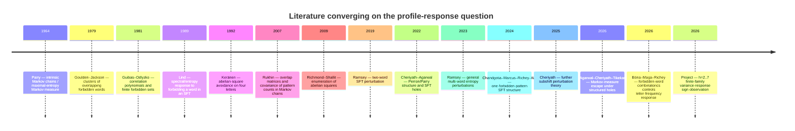

# Literature and Novelty Audit of the h=2…7 Profile-Response Project

## Executive summary

**Bottom line:** the Claude intake appears to have identified a **good core of the relevant literature**, but I would **not certify it as having captured all essential prior art**. The visible repository traces show that the literature work explicitly touched Douglas Lind, Nick Ramsey, Huang–Mao, and Rukhin, which are genuinely important methodological neighbors. fileciteturn0file3 fileciteturn0file4 However, a fresh primary-source search finds several additional works that materially sharpen the novelty assessment—most importantly a **June 2026 preprint by Bóna, Maga, and Richey on how the combinatorial structure of a forbidden word controls letter frequency in an SFT**, plus recent work by Chandgotia–Marcus–Richey–Wu on one-word SFTs and Cheriyath/Agarwal/Tikekar on holes and perturbations. citeturn14academia1turn14academia3turn12search5

That 2026 Bóna–Maga–Richey paper is the single most important new item I learned from this audit. Its overarching question is strikingly close to ours: **how do statistics of a shift change as a function of combinatorial properties of the forbidden pattern?** It studies a binary alphabet, one forbidden word, and the **mean letter frequency**; it finds that a two-variable border/autocorrelation polynomial governs the problem and investigates increase/decrease behavior under different forbidden words. citeturn15view0 Our project instead studies, under the assumptions described below, a ternary bounded-abelian-square family, **multiword deletion by an entire half-Parikh profile**, and the sign of the response of an **asymptotic-variance coefficient**. I found no paper matching that exact conjunction.

So the novelty judgment has become **more precise, not less positive**:

> **Broad idea — not novel:** forbidding words in an SFT and measuring the spectral/statistical response is an established research program. citeturn12search0turn12search1turn14academia1  
> **Methods — mostly not novel individually:** Perron/Parry analysis, Poisson/Green–Kubo asymptotic variance, pressure derivatives, correlation polynomials, and overlap matrices all have strong precedents. citeturn13search3turn13academia48turn13search0turn18search0  
> **Our specific finite-family phenomenon — apparently still novel in the literature searched:** for the 15 occurring profile-class hard deletions at \(h=2,\ldots,7\), all six minimum-\(B\) classes have positive \(\Delta a\) and all nine other classes have negative \(\Delta a\), with the result confined explicitly to this finite audited family. The repository evidence currently records that 6/6 + 9/9 split with independent variance methods and keeps novelty formally unestablished. fileciteturn0file0

I therefore judge the current direction **positively**. The literature does not make the observed 15/15 sign split look trivial or already known. On the contrary, recent work makes the *type of question* timely. But it also tells us what the theoretical burden now is: **\(B(v)\) should not be presented as the mechanism merely because it classifies the 15 cases.** Prior work repeatedly shows that responses to forbidden patterns are controlled by **self-overlap, cross-overlap, correlation/border polynomials, periodic structure, and Parry weights**. citeturn7search1turn13search8turn15view0 The promising research problem is therefore to explain why the coarse Parikh-balance statistic \(B(v)\) is apparently aligned with that richer overlap/spectral structure in this particular abelian-square family.

My confidence assessment is:

| Question | Assessment |
|---|---|
| Is the h=2…7 computational observation solid enough to study theoretically? | **Yes — high confidence**, based on the closed internal audit, not on literature novelty. fileciteturn0file0 |
| Did the original intake contain a serious core bibliography? | **Probably yes**, based on the visible Lind/Ramsey/Huang–Mao/Rukhin traces. fileciteturn0file3 |
| Did it contain *all* literature that should now be cited? | **No / not demonstrated.** Several important additional primary sources surfaced in this audit. |
| Did I find prior work stating our exact 6/6 + 9/9 result? | **No.** |
| Did I find very close conceptual prior art? | **Yes**, especially Bóna–Maga–Richey 2026. citeturn14academia1 |
| Can a literature search prove absolute novelty? | **No.** It can reduce prior-art risk substantially, but unpublished work, differently worded results, and incompletely indexed material remain possible. |
| Are we moving in a positive research direction? | **Yes — more clearly than before, but the likely novelty is in the structured variance response and its mechanism, not in the general perturbation machinery.** |

## Scope, evidence, and assumptions

There is one important limitation to this report. The actual Markdown contents of `2026-08-27_CLAUDE_PROFILE_RESPONSE_RESEARCH_INTAKE_UPDATED_2026-08-25.md` are **not retrievable in the current chat session**, so I cannot honestly perform a line-by-line citation inventory against the intake. What I do have are the project traces surrounding its creation and the final h=2…7 evidence package. Those traces show literature artifacts named `lind.json`, `ramsey.json`, `huang_mao.json`, `rukhin.json`, and `rukhin_abstract.json`, which strongly suggests that those four literature directions were deliberately investigated. fileciteturn0file3 I therefore distinguish throughout between **“the visible intake/research process appears to have covered X”** and **“the intake definitely cites X.”**

The following project assumptions are necessary because the intake itself is unavailable:

**Assumption A — mathematical family.** From the canonical half-Parikh profiles, ternary profile vectors, the repository's abelian tests, and the \(L_{h-1}\to L_h\) terminology, I interpret \(L_h\) as the project's finite-memory language obtained by imposing abelian-square avoidance constraints through half-length \(h\). This interpretation is consistent with the surrounding project material, but I am not treating it as a quotation from the inaccessible intake. The classical abelian-square literature defines an abelian square as two consecutive blocks that are permutations of one another, and the four-letter avoidance threshold is due to Keränen; infinite full abelian-square avoidance is impossible over three letters. citeturn7search15turn19search2

**Assumption B — perturbation.** A profile deletion removes all relevant forbidden-pattern/edge instances belonging to one canonical half-Parikh profile \(v\), rather than merely deleting a single word. This matters enormously for prior-art comparison: multiword perturbation theory is a closer analogue than the much larger one-forbidden-word literature. The final project material fixes 15 occurring classes with profile-count vector \([2,2,1,3,3,4]\) across \(h=2,\ldots,7\). fileciteturn0file0

**Assumption C — response observable.** The coefficient \(a\) is an asymptotic-variance-type quantity computed by a Poisson/Green–Kubo method, an independent moment-growth method, and pressure-curvature spot checks. The accessible project evidence does not give me enough context to name the underlying additive observable with confidence, so I do **not** assume it is simply raw letter frequency or a particular letter-balance coordinate. This distinction is important because Bóna–Maga–Richey study a **mean** statistic, whereas our audited response is a **variance** response. fileciteturn0file4

**Assumption D — claim boundary.** The scientific claim being evaluated for novelty is exactly the finite-family statement for \(h=2,\ldots,7\): 15 profile classes, six minimum-\(B\) classes with positive hard-deletion response and nine others with negative response. It is not an arbitrary-\(h\) theorem, not a causal theorem about \(B\), and not an \(h=8\) prediction. The final repository certificates explicitly retain `NOVELTY_STATUS = NOT_ESTABLISHED` and keep \(h=8\) blind. fileciteturn0file0

Those assumptions mean the novelty assessment below is **strong enough to guide the project**, but publication-grade novelty wording should ultimately be checked against the actual intake and against the exact definition of the observable \(a\).

## Literature landscape and closest prior art

The literature naturally separates into four intersecting traditions: forbidden-word perturbations of SFTs; overlap/correlation-polynomial methods; statistical response and asymptotic variance of Markov/Gibbs systems; and abelian-square/Parikh-vector combinatorics.

The most important point is that **none of these traditions alone subsumes the project**. The novelty candidate sits at their intersection.

| Work | Year | Methods | Datasets / graphs | Key results | Overlap risk | Novelty gap relative to our project |
|---|---:|---|---|---|---|---|
| Guibas & Odlyzko, *String Overlaps, Pattern Matching, and Nontransitive Games* citeturn7search1 | 1981 | String correlation matrices/polynomials; generating functions | Finite sets of forbidden strings in \(q\)-ary words | Introduces correlation of strings and derives generating functions for words avoiding a finite pattern set | **High methodological** | Does not study Parikh-profile grouped deletions or change in an SFT asymptotic variance |
| Lind, *Perturbations of Shifts of Finite Type* citeturn12search0 | 1989 | Perron roots, SFT presentations, correlation polynomials, zeta functions | One admissible forbidden word in an SFT | Quantifies spectral-radius/entropy drop after forbidding a word; response depends on correlation structure | **High conceptual** | Spectral/entropy response, not our variance response; one word, not profile-class multiword deletion |
| Keränen, *Abelian Squares are Avoidable on 4 Letters* citeturn7search15 | 1992 | Morphisms and computer verification | Abelian-square-free words over four symbols | Establishes infinite abelian-square avoidance over four letters | **Low result overlap; high problem-background importance** | Our bounded ternary SFT/statistical perturbation question is a different problem |
| Rukhin, *Pattern Correlation Matrices for Markov Sequences and Tests of Randomness* citeturn13search0turn13search1 | 2006/07 | Pattern-correlation matrices, resolvents, asymptotic moment expansions | Pattern counts in Markov sequences | Expresses first two moments and covariance structure of pattern frequencies through overlap/correlation information | **High methodological** | Studies variance of pattern occurrence counts within a fixed Markov source, not response of a new Parry chain after deleting a Parikh-profile class |
| Richmond & Shallit, *Counting Abelian Squares* citeturn7search0turn7academia48 | 2009 | Enumerative combinatorics and asymptotics | Abelian squares over finite alphabets | Counts abelian squares and derives asymptotics | **Low direct** | Gives combinatorial baseline but no SFT perturbation or variance-response law |
| Ramsey, *Perturbing Subshifts of Finite Type: Two Words* citeturn12academia42 | 2019 | Multiword correlation polynomials | SFT with two newly forbidden words | Extends Lind's entropy-perturbation analysis to two words | **High methodological** | Still entropy rather than asymptotic variance; only two words rather than structured Parikh classes |
| Cheriyath & Agarwal, *Subshifts of Finite Type with a Hole* citeturn13search8turn13search9 | 2022 | Correlation functions, escape rates, holes, periods | Unions of equal-length cylinder sets | Shows that escape behavior of multi-cylinder holes depends on correlations and minimal periods; cross-correlations can reverse naive orderings | **Very high conceptual** | Closely supports the need for overlap descriptors, but response variable is escape rate rather than our \(a\) |
| Cheriyath & Agarwal, *On the Perron Root and Eigenvectors Associated with a Subshift of Finite Type* citeturn13academia50turn13search2 | 2022 | Forbidden-word correlations, Perron–Frobenius eigenvectors | Irreducible SFT adjacency graphs | Connects forbidden-word correlation structure with Perron eigenvectors and gives an alternative Parry-measure construction | **High methodological** | Does not state a Parikh-balance sign rule for statistical variance response |
| Huang & Mao, *Variational Formulas of Asymptotic Variance for General Discrete-time Markov Chains* citeturn13academia48turn13search15 | 2020/23 | Poisson equation, variational characterization, Markov perturbation comparison | General discrete-time nonreversible Markov chains | Gives general formulas and comparison results for asymptotic variance under changes to a Markov chain | **High methodological** | Provides theory behind the observable/method, but no forbidden-word or abelian-profile classification |
| Ramsey, *Entropy Bounds for Multi-word Perturbations of Subshifts* citeturn12search1 | 2023/24 | SFT entropy bounds under finite forbidden sets | General finite sets of words added to an SFT | Gives criteria controlling entropy changes for multiword perturbations | **High structural** | Again entropy, not variance; no Parikh grouping or sign split |
| Chandgotia, Marcus, Richey & Wu, *Shifts of Finite Type Obtained by Forbidding a Single Pattern* citeturn14academia3 | 2024 preprint | Autocorrelation polynomial, labeled graphs, Perron–Frobenius, conjugacy invariants | Binary/finite-alphabet one-forbidden-word SFTs | Systematizes how self-overlap of a forbidden word determines counting and dynamical invariants | **Very high conceptual** | Single-pattern rather than profile-class perturbation; no asymptotic-variance response law |
| Cheriyath, *A Note on the Perturbations of Subshifts* citeturn14academia0 | 2025 | Symbolic-dynamical perturbation theory | Sofic, synchronized, coded, and SFT systems | Extends the study of perturbations by forbidden words, including multiword SFT entropy effects | **Medium–high** | Broadens the established perturbation framework but not our statistic or abelian structure |
| Agarwal, Cheriyath & Tikekar, *Escape Rate for Shifts with Markov Measure* citeturn12search5turn12academia44 | 2024 preprint / 2026 journal | Perturbed stochastic matrices, recurrence relations, spectral radius | SFT with Markov measure and finite collections of allowed-word cylinders as holes | Computes escape rates and compares different structured holes | **Very high methodological** | This is close to our Parry/edge-mass layer but still analyzes survival/escape rather than equilibrium fluctuation variance |
| **Bóna, Maga & Richey, *Letter Frequency in Shifts of Finite Type with One Forbidden Word*** citeturn14academia1turn15view0 | **2026** | **Border polynomial, generating functions, Parry chain, injections/bijections** | **Binary SFT; one forbidden word** | **Studies precisely how a statistic changes with combinatorial features of the forbidden pattern; classifies many increase/decrease cases and conjectures monotonicity with word composition** | **Highest thematic overlap found** | **Mean letter frequency, binary, one forbidden word. No asymptotic-variance response; no ternary abelian-square profile class; no 6/6 + 9/9 \(B(v)\) rule** |

Two more foundational citations should sit underneath this table even though they are not direct prior-art threats. Parry's 1964 *Intrinsic Markov Chains* is the classical source behind the measure of maximal entropy/Parry-chain construction used throughout finite-state symbolic dynamics. citeturn13search3 Goulden and Jackson's 1979 cluster theorem gives a general generating-function framework in which **overlap clusters of forbidden words** determine word-avoidance enumeration; Bóna–Maga–Richey explicitly invoke this machinery for their weighted generating functions. citeturn18search0turn15view0

The chronology makes the convergence of these literatures clearer:



The dated literature items in that timeline are supported by the corresponding primary publications above. citeturn13search3turn18search0turn7search1turn12search0turn7search15turn13search0turn7search0turn12academia42turn13search8turn12search1turn14academia3turn14academia0turn12search5turn14academia1

## What the novelty audit actually taught us

The most important result of this audit is **not simply “nobody did exactly this before.”** It is a much more useful structural conclusion about where the novelty probably lives.

### The forbidden-pattern response question itself is established

Lind already framed forbidding an admissible word as a perturbation of an SFT and related the perturbation to spectral data and the word's correlation polynomial. citeturn12search0 Ramsey generalized that direction to two and then multiple forbidden words. citeturn12academia42turn12search1 Cheriyath and collaborators have developed closely related hole/escape-rate formulations in which finite collections of words modify a symbolic or Markov system. citeturn13search8turn12search5

Accordingly, a paper from this project should **not** claim novelty merely for “deleting a class of forbidden patterns and seeing how the system changes.”

### The variance machinery is also precedent, not the main novelty

Poisson-equation and Green–Kubo representations of asymptotic variance are standard within Markov-process theory, and Huang–Mao explicitly derive asymptotic-variance comparison formulas under Markov-chain perturbations. citeturn13academia48 Thermodynamic-formalism work likewise connects pressure derivatives with fluctuation quantities, and modern work on pressure for SFTs treats higher derivatives through the associated central-limit processes. citeturn20academia27

This is actually **good news**. It means the project does not need methodological novelty in order to be interesting. Using several established representations of the same variance to independently verify the calculation is scientifically strong, but the novelty claim should attach to **what those methods uncover in this special combinatorial family**.

### The real close precedent is now Bóna–Maga–Richey

Their 2026 paper asks how local statistics of uniformly random long words in an SFT depend on combinatorial features of the forbidden word. They show that the relevant information in their one-word binary setting is encoded by a **two-variable border polynomial**, and they classify many cases where forbidding a pattern drives the frequency of \(1\)'s up or down. citeturn15view0 They even focus explicitly on **balanced forbidden words**, showing that border balance is relevant to whether letter density remains \(1/2\). citeturn15view0

That is not our result, but the conceptual parallel is unusually strong:

\[
\text{forbidden-pattern combinatorics}
\quad\longrightarrow\quad
\text{sign/direction of statistical response}.
\]

Their statistic is a first-moment quantity. Ours, under Assumption C, is a second-order fluctuation quantity. Their perturbation is one binary word. Ours groups many ternary forbidden instances according to a Parikh profile. Their structural invariant is a border/autocorrelation polynomial. Our empirical classifier is

\[
B(v)=\sum_i (v_i-h/3)^2.
\]

That makes the project **more publishably connected to an active question**, but also means we should cite Bóna–Maga–Richey prominently and explicitly separate our contribution from theirs. citeturn14academia1

### The literature warns us not to treat \(B(v)\) as causal yet

Guibas–Odlyzko showed long ago that avoidance depends on the **overlap structure** of the forbidden set, not merely on coarse symbol counts. citeturn7search1 Cheriyath–Agarwal show that cross-correlations between hole words can invalidate naive orderings that hold in zero-cross-correlation situations. citeturn13search8 Bóna–Maga–Richey likewise find their letter-frequency statistic is governed by a border polynomial containing both length and composition information about self-overlaps. citeturn15view0 Rukhin's work independently connects pattern-correlation matrices to the **covariance structure** of pattern counts in Markov sequences. citeturn13search0

This changes how I interpret our 15/15 result. The strongest working hypothesis is **not**

\[
B(v)\text{ directly causes the sign of }\Delta a.
\]

A better theory target is

\[
v
\;\longrightarrow\;
\text{family of overlaps/correlations}
\;\longrightarrow\;
\text{perturbed Perron/Parry chain}
\;\longrightarrow\;
\text{Green--Kubo covariance response}
\;\longrightarrow\;
\operatorname{sign}(\Delta a),
\]

with \(B(v)\) acting as a surprisingly effective **low-dimensional proxy** for the overlap geometry within this highly structured abelian-square family. That is an inference from the literature plus the project observation, not something currently proved. citeturn7search1turn13search0turn13academia50

### The Parry-mass quantity \(q_v\) also acquires a clearer role

The hole/escape-rate literature provides a useful analogy: the mass of a hole is an obvious first descriptor, but periodicity and correlations influence its actual dynamical effect. Cheriyath–Agarwal explicitly formulate escape behavior in terms of correlations and minimal period, while Agarwal–Cheriyath–Tikekar express Markov-hole escape through perturbed stochastic matrices and recurrence structure. citeturn13search8turn12search5

By analogy, our \(q_v\) is naturally interpreted as an **exposure/weight variable**, but there is no reason from prior theory to expect it alone to determine a second-order variance response. The fact that the project has separately audited \(q_v\) and the variance response is therefore useful: it sets up precisely the question of which additional overlap/resolvent information turns “how much mass was removed?” into “how did long-range fluctuations change?” The project artifacts record independent \(q_v\) agreement and the finite-family sign pattern separately. fileciteturn0file4

### The abelian-square context itself still looks differentiated

Classical abelian-square work concentrates predominantly on **avoidability, construction, enumeration, growth, and algorithmic detection**. Keränen established four-letter infinite avoidance; Richmond–Shallit count abelian squares; later work studies partial words, \(k\)-abelian repetition, long abelian repetitions, and related avoidability questions. citeturn7search15turn7search0turn19search2turn11academia45

I found no primary source connecting **canonical half-Parikh classes of abelian-square constraints** to the **sign of the asymptotic-variance response of the maximal-entropy process**. That negative search result is not a mathematical proof of novelty, but it is the key empirical novelty-audit outcome.

## Search coverage, omissions, and how complete the intake really is

The visible traces suggest the original intake was **strong on four central methodological pillars**: Lind for SFT perturbations, Ramsey for multiword perturbations, Huang–Mao for asymptotic variance, and Rukhin for pattern-correlation covariance. fileciteturn0file3 That was a good selection. I would preserve all four.

However, for a publication-oriented intake I would now regard the following as **essential additions**.

First, **Bóna–Maga–Richey 2026 is mandatory**. It is too close in research question and too recent to omit. Their paper explicitly poses the general question of how local statistics depend on combinatorial properties of a forbidden set and uses Parry-chain calculations, border polynomials, and generating functions. citeturn14academia1turn15view0

Second, **Chandgotia–Marcus–Richey–Wu** should be included because it modernizes the one-forbidden-word SFT/correlation-polynomial picture and is directly part of the literature lineage to which the 2026 letter-frequency work belongs. citeturn14academia3

Third, **Cheriyath–Agarwal's SFT-hole papers and the 2026 Markov-measure escape paper** belong in the intake because profile deletion is naturally a **multi-cylinder/multiword hole-like perturbation**, and those papers make the importance of cross-correlations and periods explicit. citeturn13search8turn12search5

Fourth, the intake should point back to **Guibas–Odlyzko 1981 and Goulden–Jackson 1979**, not only to later descendants, because those are the original overlap/cluster foundations. citeturn7search1turn18search0

Fifth, the abelian side should contain at least **Keränen** and **Richmond–Shallit**, with one clear citation establishing the ternary/full-avoidance context. citeturn7search15turn7search0turn19search2 If the intake already contains these, no action is needed except integrating them into the novelty narrative rather than leaving them as background bibliography.

Sixth, **Parry 1964** should be cited when the paper invokes the intrinsic maximal-entropy Markov chain rather than treating the Parry construction as merely implementation folklore. citeturn13search3

The searches used in this audit deliberately attacked the problem under different vocabularies rather than only searching for the project's own terminology. Representative queries were:

```text
"asymptotic variance" "forbidden word" shift finite type
"asymptotic variance" subshift forbidden pattern
"variance" "single forbidden word" shift finite type
"letter frequency" forbidden word shift finite type

"perturbations of shifts of finite type"
"multi-word perturbations" subshifts
subshift finite type hole Markov measure forbidden words
Perron root eigenvectors forbidden words Parry measure

"Parikh vector" "shift of finite type"
"abelian square" "shift of finite type" entropy
ternary words avoiding abelian squares bounded period
"short abelian squares" ternary words

string overlaps correlation polynomial forbidden words
Goulden Jackson cluster method forbidden words
pattern correlation matrices Markov sequences variance

2025 2026 forbidden word SFT local statistics
2026 forbidden word letter frequency symbolic dynamics
2026 shifts finite type forbidden pattern statistics
```

I also followed the citation lineage outward from recent close papers: Bóna–Maga–Richey back toward Guibas–Odlyzko and the cluster method; Ramsey back toward Lind; and Cheriyath/Agarwal toward correlation-polynomial, Perron/Parry, and hole theory. That matters because the exact phrase “profile response” is project-specific and would miss almost all of the established literature.

Even after that effort, I would describe novelty-search completeness as **high but not absolute**. The remaining uncertainty comes from three places: very recent/unpublished manuscripts may not be indexed; a theorem may be phrased in a mathematically equivalent but terminologically distant way; and I did not conduct an exhaustive subscription-database sweep of every MathSciNet/zbMATH citation branch. Accordingly, the defensible scholarly wording is **“we found no prior work studying this exact combination”**, not **“no prior work exists.”**

There is also one useful adjacent literature item that is **not direct prior art but helps place the project**: Richard and Grimm studied entropy and constrained letter frequencies in ternary square-free words, showing that avoidance languages, entropy, and letter-composition statistics have been studied together before. Their objects are ordinary squares rather than abelian squares, so the overlap risk is low, but it is a useful bridge citation between combinatorics on words and statistical mechanics of constrained languages. citeturn11search0

## Recommended project direction

No new computation is necessary for the following actions. They are conceptual, bibliographic, and positioning steps.

### Upgrade the intake from a bibliography into a prior-art map

Each close source should be given three explicit fields:

**what it establishes → what machinery it contributes → what it does not establish that we need.**

For example:

> Bóna–Maga–Richey: statistical response to a single forbidden binary word; border polynomial + Parry chain; **does not study asymptotic variance or multiword Parikh-profile deletion**. citeturn14academia1

> Cheriyath–Agarwal: multi-cylinder holes and correlation-dependent escape; **does not give our fluctuation-response sign classification**. citeturn13search8

> Rukhin: pattern overlap controls covariance of counts in a Markov sequence; **does not study a new maximal-entropy chain created by hard deletion**. citeturn13search0

That format will make future novelty checks dramatically less painful because the intake will encode **claim boundaries**, not merely titles.

### Reframe the central research question around overlap structure

The next theoretical question should not be “can we fit another scalar predictor to the 15 cases?” The literature already tells us that the canonical language for forbidden-pattern effects is **overlap/correlation structure**. citeturn7search1turn18search0turn13search8

The more promising question is:

\[
\boxed{
\text{Why does Parikh balance }B(v)
\text{ appear to predict the sign of a response
that should fundamentally depend on overlaps?}
}
\]

That is a much stronger research story.

It also tells us what the project's already-proposed theory objects are for. An overlap matrix, border matrix, \(T_v\), \(\Theta_v\), \(\eta_v\), or related invariant should be justified as an attempt to interpolate between:

\[
\text{coarse composition }v
\quad\text{and}\quad
\text{full correlation geometry}.
\]

In particular, any candidate invariant \(J(v)\) is interesting only if it can be related mathematically to the **correlation/resolvent terms that enter the perturbed Parry chain or Green–Kubo variance**. Rukhin's covariance formulas and Guibas–Odlyzko/Cheriyath overlap machinery provide concrete literature anchors for that program. citeturn13search0turn7search1turn13academia50

### Position \(B(v)\) as an empirical organizing variable, not the final invariant

For the present finite family, the computational result is unusually clean: 15/15 agrees with the minimum-\(B\)/nonminimum-\(B\) sign split. fileciteturn0file0 That absolutely warrants investigation.

But the literature makes an important prediction about what a successful theory is likely to look like: **two forbidden sets with the same coarse symbol counts can behave differently if their overlap structures differ**. Guibas–Odlyzko's correlation framework makes this possible in principle, and Cheriyath–Agarwal explicitly show cross-correlation can destroy simple hole orderings. citeturn7search1turn13search8

Therefore a strong paper would ideally end up with one of two outcomes:

\[
\textbf{Outcome A:}\quad
B(v)\Rightarrow\text{a constrained overlap identity}
\Rightarrow \operatorname{sign}\Delta a,
\]

which would be a beautiful structural theorem for the abelian-square family; or

\[
\textbf{Outcome B:}\quad
B(v)\text{ is only a proxy, and a finer invariant explains the 15 cases},
\]

which would still be scientifically valuable, because it would identify the actual mechanism behind the discovered pattern.

### Treat the 2026 letter-frequency work as an opportunity, not a threat

Bóna–Maga–Richey makes the general theme demonstrably active in 2026. Their paper explicitly says that understanding how local statistics depend on combinatorial features of forbidden patterns is an overarching question, and that even the one-word binary case leaves significant ordering questions open. citeturn15view0

Our project can occupy a clean next layer:

\[
\begin{array}{c}
\text{single forbidden word}\\
\text{mean/local density}
\end{array}
\quad\longrightarrow\quad
\begin{array}{c}
\text{structured multiword profile deletion}\\
\text{second-order fluctuation / asymptotic variance}.
\end{array}
\]

That is not a claim that our work is a formal extension of theirs; it is a **positioning opportunity** supported by the difference in objects and observables. citeturn14academia1turn12search1

### Freeze a publication-safe novelty sentence now

I would use something close to:

> **“To our knowledge, prior work on forbidden-word perturbations of shifts of finite type has studied entropy, spectral radius, escape rates, and more recently letter-frequency response, while work on Markov pattern correlations has characterized occurrence covariances. We are not aware of prior work studying the sign of the change in asymptotic variance under deletion of entire Parikh-profile classes of abelian-square constraints. Our present evidence for the resulting balance/sign relation is computational and restricted to \(h=2,\ldots,7\).”**

Every component of the prior-work half of that statement has direct support. citeturn12search0turn12search1turn12search5turn14academia1turn13search0 The second half accurately preserves the repository's current bounded claim status. fileciteturn0file0

That is far safer and stronger than either “this is novel” or “nobody has studied this.”

## Ethical, attribution, and scholarly considerations

The main ethical issue is **priority and attribution**, not research conduct. Because the Bóna–Maga–Richey preprint appeared on June 4, 2026—only months before this project phase—it should be cited prominently even though its exact theorem is different. citeturn16view1 The same principle applies to the 2024/2026 Chandgotia–Marcus–Richey–Wu line and the 2026 Agarwal–Cheriyath–Tikekar journal work. citeturn14academia3turn12search5 Recent preprints deserve attribution where they materially shaped or independently anticipated the research question.

The project should also avoid presenting standard machinery as an original contribution. Correlation polynomials trace at least to Guibas–Odlyzko; cluster decompositions to Goulden–Jackson; SFT perturbation to Lind and later Ramsey; the maximal-entropy Markov construction to Parry; and Poisson-equation asymptotic-variance theory has a substantial independent Markov-chain literature. citeturn7search1turn18search0turn12search0turn13search3turn13academia48 Using those tools together in a new setting can certainly be part of a contribution, but their provenance should be explicit.

A second attribution concern is terminology. **“Balance” is overloaded.** Bóna–Maga–Richey discuss balanced binary forbidden words and balanced borders, whereas our \(B(v)\) is a quadratic distance of a ternary Parikh vector from the uniform composition \(h/3\). citeturn15view0 A paper should define “Parikh balance” or “composition imbalance” carefully so that readers do not infer identity with the border-balance concept in that paper.

A third concern is negative-result language. Literature searches cannot prove that nobody has done something. The ethically and epistemically appropriate formulation is always **“we are not aware of…”** plus a description of the search scope. That is especially important here because the closest neighboring work is moving quickly in 2025–2026. citeturn14academia0turn14academia1

## Bottom line: what we learned and whether the direction is positive

**Yes, I learned something genuinely new from this audit, and yes, I think the project is moving in a positive direction.**

The most important new knowledge is that the surrounding literature has recently moved **much closer to our conceptual question than the older Lind/Ramsey perturbation literature alone would suggest**. The June 2026 Bóna–Maga–Richey paper explicitly asks how combinatorial properties of a forbidden pattern control a statistical response of the resulting SFT and obtains increase/decrease phenomena using border structure. citeturn14academia1turn15view0 Chandgotia–Marcus–Richey–Wu and Cheriyath/Agarwal provide the complementary result that forbidden-word overlap structure is deeply tied to Perron, counting, conjugacy, and escape behavior. citeturn14academia3turn13academia50turn13search8 Rukhin independently shows that the same kind of pattern-overlap information enters covariance and second moments of Markov pattern statistics. citeturn13search0

That triangulation is valuable:

\[
\boxed{
\text{overlap combinatorics}
\leftrightarrow
\text{Perron/Parry dynamics}
\leftrightarrow
\text{statistical fluctuations}
}
\]

and our project appears to have discovered a remarkably simple finite-family signature—Parikh balance \(B(v)\)—inside precisely that triangle.

The literature audit therefore **reduces one kind of optimism and increases a better kind**.

It reduces the weak claim:

> “Maybe nobody has ever studied statistical responses to forbidden patterns.”

That is plainly false. They have. citeturn12search0turn14academia1

But it increases confidence in the much more specific claim:

> “There may be a new structural phenomenon in how a highly symmetric family of abelian-square profile deletions changes a second-order equilibrium statistic.”

I found **no direct prior result** giving the h=2…7 6/6 + 9/9 variance-response sign split, no result classifying such responses by a ternary half-Parikh imbalance \(B(v)\), and no paper combining the exact ingredients of **abelian-square profile classes + structured multiword hard deletion + maximal-entropy/Parry dynamics + asymptotic-variance sign response**. The current project evidence, meanwhile, records the finite-family observation consistently under two independent variance calculations while explicitly refusing to extrapolate beyond \(h=7\). fileciteturn0file0

So my current research judgment is:

\[
\boxed{
\textbf{positive direction, with a substantially sharper novelty target}
}
\]

The most promising potential contribution is **not the 15/15 table by itself**, and not another round of numerical confirmation. It is an explanation of why the abelian-square profile structure forces—or approximately forces—the overlap/Parry/resolvent quantities governing asymptotic variance to organize themselves according to composition balance.

That also answers what I think was missing from the earlier intake at the strategic level. We should no longer think of the project merely as

\[
B(v)\quad\text{vs.}\quad\Delta a_v.
\]

The literature suggests the deeper research diagram is

\[
\boxed{
B(v)
\;\longleftrightarrow\;
\text{Parikh symmetry}
\;\longleftrightarrow\;
\text{self/cross-overlap structure}
\;\longleftrightarrow\;
\text{Perron/Parry perturbation}
\;\longleftrightarrow\;
\text{Green--Kubo covariance response}
}
\]

and the scientifically interesting question is **which arrows in that diagram can actually be proved**.

That is a considerably better-defined—and, in my assessment, more promising—research program than where we started.