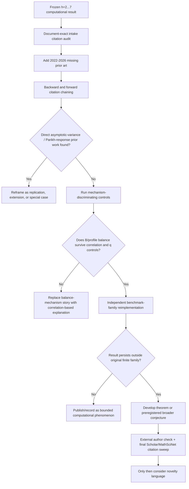
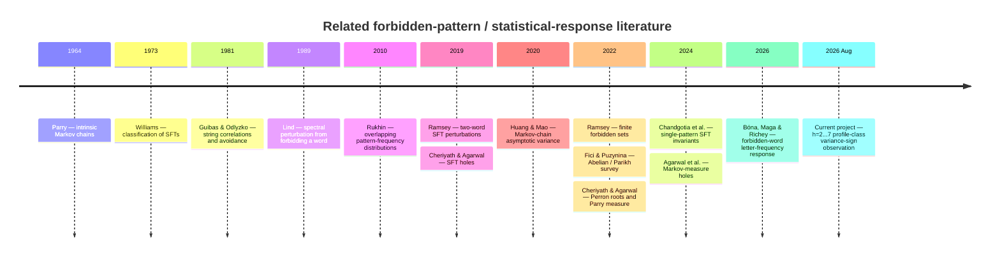

# Novelty and Literature Audit of the Claude Profile-Response Research Intake

## Executive summary

**Bottom line:** the current Claude intake should **not yet be treated as sufficient evidence for a novelty claim**, although the underlying h=2…7 computational result can remain closed and can safely be recorded as a **bounded internal computational observation**. The literature search found no direct match for the project's exact combination of a profile-class deletion family, a balance functional
\[
B(v)=\sum_i(v_i-h/3)^2,
\]
and the **sign of an asymptotic-variance response**. That is encouraging. However, the broader research territory is already well developed: forbidding words or groups of words in shifts of finite type, studying the resulting spectral/entropy or escape-rate perturbation, relating the response to overlap/correlation structure, and studying local-statistic changes are all established topics. citeturn28search0turn26academia1turn26academia2turn26academia0

The most important new finding is a June 4, 2026 preprint by **Miklós Bóna, Balázs Maga, and Jacob Richey, “Letter frequency in shifts of finite type with one forbidden word.”** It asks almost exactly the same *high-level kind of question*: how a statistical observable changes when a forbidden pattern is imposed, and how the sign/order of that response depends on combinatorial properties of the forbidden word. Their statistic is **mean letter frequency**, not asymptotic variance; their setting is binary and single-word rather than the project's profile-class deletion family. Nevertheless, they explicitly classify forbidden words according to whether letter frequency increases, decreases, or remains unchanged, and conjecture monotonicity related to letter composition. This is a **strong conceptual near-overlap** that the intake should cite prominently. citeturn26academia3

A second important cluster is the work of **Lind**, **Ramsey**, **Cheriyath–Agarwal**, and **Agarwal–Cheriyath–Tikekar** on perturbing SFTs by forbidden words or “holes.” Lind's 1989 paper treats spectral-radius changes after forbidding a word; Ramsey extends perturbation theory to pairs and finite sets of forbidden words; Cheriyath–Agarwal analyze unions of cylinders through correlation structure and escape rates; and the 2024 Markov-measure work formulates escape rates through perturbed stochastic matrices. Those are not the project's exact variance-response result, but they occupy much of the surrounding conceptual territory. citeturn28search0turn26academia1turn26academia2turn26academia0turn27academia3

The project's **methods themselves should not be presented as novel**. Parry-measure constructions, Perron–Frobenius/SCC reasoning, Markov-chain asymptotic variance, forbidden-pattern correlation machinery, pressure derivatives, and presentation/conjugacy invariance all sit in mature literatures. citeturn30search3turn27academia0turn28search3turn29search5turn30search1 What may be novel is the *particular connection* between a Parikh-composition balance class and the sign of the variance response.

My overall risk assessment is therefore:

| Question | Assessment |
|---|---|
| Exact duplication of the observed h=2…7 6/6 + 9/9 variance-sign split | **Low-to-moderate risk; no direct match found** |
| Duplication of the broad “forbid patterns and measure the response” idea | **High; established prior work** |
| Duplication of “combinatorial composition predicts statistical response” | **Medium-to-high; Bóna–Maga–Richey is notably close** |
| Duplication of the numerical/mathematical methods | **High and expected; methods are standard/foundational** |
| Confidence that the narrow observation is publication-level novel today | **Moderate, not sufficient yet** |
| Safe ledger status | **NOVELTY_STATUS = NOT_ESTABLISHED** |

There is also an important audit limitation. In this session, the actual Markdown body of `2026-08-27_CLAUDE_PROFILE_RESPONSE_RESEARCH_INTAKE_UPDATED_2026-08-25.md` is not retrievable. The available repository transcripts show the filename and literature-query artifacts named `lind.json`, `ramsey.json`, `huang_mao.json`, `rukhin.json`, and `rukhin_abstract.json`, but they do not expose the intake's complete reference section. Accordingly, **Table A below is an evidence-based reconstruction of the intake's apparent literature set, not a certified document-exact bibliography**. A document-exact citation audit remains necessary before claiming that the intake itself contains every required source. The transcript does establish that these literature-query artifacts existed during the research workflow. fileciteturn0file0

My owner-level recommendation is therefore:

> **Approve the computational h=2…7 claim, but do not approve any novelty wording yet. Update the intake with the missing/uncertain literature below—especially Bóna–Maga–Richey 2026, Cheriyath–Agarwal, Agarwal–Cheriyath–Tikekar, Chandgotia–Marcus–Richey–Wu, Guibas–Odlyzko, Parry, and the Abelian/Parikh literature—then perform citation chaining around the 2026 papers and one targeted mechanism experiment.**

## Intake citation inventory and support quality

The repository history strongly suggests that Lind, Ramsey, Huang–Mao, and Rukhin were deliberately investigated for the intake: separate downloaded/query-result files bearing those authors' names appear alongside the intake document in the working tree. fileciteturn0file0 Because the Markdown itself is not accessible here, I cannot responsibly claim that every one of them actually appears in the final prose, nor can I identify additional references that may be present.

### Table A — Provisional inventory of intake citations

| Citation | Type | Relevance score (1–5) | Notes |
|---|---|---:|---|
| [Douglas A. Lind, “Perturbations of Shifts of Finite Type,” SIAM J. Discrete Math. 2(3), 350–365 (1989)](https://doi.org/10.1137/0402031) | Paper — **primary** | **5** | **Apparently investigated for intake; presence should be verified.** Foundational direct context: studies the spectral-radius change caused by forbidding a fixed word in an SFT and expresses the perturbation using correlation-polynomial machinery. It strongly supports the claim that hard forbidden-word perturbations have established spectral theory; it does **not** support the project's variance-sign/B-balance law. citeturn28search0 |
| [Nick Ramsey, “Perturbing subshifts of finite type: two words,” arXiv:1902.03352](https://arxiv.org/abs/1902.03352) | Preprint — **primary** | **5** | **Apparently investigated.** Extends Lind-style entropy perturbation analysis to two forbidden admissible words and develops multi-word correlation polynomials. Very relevant if a profile-class deletion corresponds to simultaneously removing multiple words/edges. citeturn26academia1 |
| [Nick Ramsey, “Perturbing Subshifts of Finite Type,” arXiv:2201.05656](https://arxiv.org/abs/2201.05656) | Preprint — **primary** | **5** | It is unclear whether the intake's `ramsey.json` refers to this version, the 2019 paper, or both. This later paper considers a **finite set** of forbidden words and entropy perturbation, making it especially relevant to class deletion. It should be cited even if the earlier Ramsey paper already is. citeturn26academia2 |
| [Lu-Jing Huang and Yong-Hua Mao, “Variational Formulas of Asymptotic Variance for General Discrete-time Markov Chains,” arXiv:2012.13895](https://arxiv.org/abs/2012.13895) | Preprint — **primary** | **4** | **Apparently investigated.** Strong methodological support for asymptotic variance of nonreversible discrete-time Markov chains and perturbation comparisons. It validates the general methodological setting but does not establish the project's forbidden-profile sign behavior. citeturn27academia0 |
| [Andrew L. Rukhin, “Joint Distribution of Pattern Frequencies and Multivariate Polya–Aeppli Law,” Theory Probab. Appl. 54 (2010)](https://www.nist.gov/publications/joint-distribution-pattern-frequencies-and-multivariate-polya-appli-law) | Paper — **primary** | **4** | **Apparently investigated.** Studies frequencies of several overlapping words in a Markov sequence using pattern-correlation and Markov fundamental matrices. Strong supporting context for pattern-count covariance/statistical machinery, but not a deletion-response theorem. citeturn30search0 |

The four author clusters above are useful, but **they are not a sufficient literature foundation by themselves**. In particular, an intake that jumps from Lind/Ramsey to Huang–Mao/Rukhin would miss three important bridges:

First, **forbidden-word correlations and Parry/Perron structure** are much closer to the project's actual symbolic-dynamical setup than generic Markov variance theory alone. Cheriyath and Agarwal derive Perron roots/eigenvectors for SFTs in terms of correlations between forbidden words and explicitly connect this with the Parry measure. citeturn30search3turn30academia47

Second, **grouped holes under Markov measures** are a natural analogue of profile-class deletions. Cheriyath–Agarwal treat unions of cylinders based at several words, while Agarwal–Cheriyath–Tikekar work directly with an SFT carrying a Markov measure and express escape rates through a perturbed stochastic matrix. citeturn26academia0turn27academia3

Third, the project's “half-Parikh” terminology rests on standard **Parikh-vector/Abelian equivalence** language, and this should be cited explicitly so readers can distinguish standard background from the project's own specialization. Fici and Puzynina define Abelian equivalence precisely by equality of Parikh vectors and survey the area. citeturn27academia2

The intake should also make a clear terminology distinction: **“half-Parikh profile” appears to be project-specific terminology**, whereas Parikh vectors and Abelian equivalence are standard concepts. My exact-term searches of arXiv/web sources and public GitHub code did not identify a mathematical prior use of “half-Parikh profile.” Public GitHub searches likewise returned no credible matching repository for that expression. That is useful nomenclature evidence, but it is **not evidence that the underlying mathematical idea is novel**.

## Literature landscape and overlap search

I searched the exact project terms requested—`profile-class hard deletions`, `half-Parikh profile`, the displayed \(B(v)\) expression, `profile-response`, `RUN3C`, `spectral dominance`, `unique dominant SCC`, `presentation invariance`, `q_v variance`, and `pressure-curvature Method C`—and also broadened the search semantically to combinations of *forbidden word*, *SFT perturbation*, *Markov measure*, *escape rate*, *asymptotic variance*, *Parikh/composition*, *pattern frequency*, and *correlation polynomial*. Exact project phrases did not lead to an identifiable published mathematical line of work; the semantically broadened searches did.

This distinction is critical. `RUN3C`, `Method C`, `profile-response`, and probably `q_v` are internal labels. Searching only those terms would artificially inflate novelty confidence. The surrounding mathematical questions already have a substantial literature.

### Foundational forbidden-pattern perturbation

The closest classical ancestor is **Lind 1989**. He explicitly studies the consequences of forbidding a fixed word in a shift of finite type, including the resulting spectral-radius drop, with expressions involving the word's correlation polynomial. citeturn28search0 The even earlier **Guibas–Odlyzko 1981** correlation framework defines correlations between strings and derives generating functions for words avoiding a finite set of patterns. That machinery is foundational for much later forbidden-word SFT work. citeturn28search3turn28search4

Ramsey's two papers move even closer to the project because they treat **multiple forbidden words** rather than one. The 2019 paper adapts Lind's method to two words; the 2022 preprint formulates perturbation by an arbitrary finite set \(S\) of forbidden words. citeturn26academia1turn26academia2

This means a future paper should not say something like:

> “We introduce the study of how deleting a class of forbidden words changes an SFT.”

That would be too broad and would overlap established work. A defensible distinction is that the project studies a **specific additive-observable asymptotic variance**, and asks whether the **sign** of its change is organized by a Parikh-composition balance class.

### Holes, Markov measures, and grouped deletions

Cheriyath and Agarwal's **Subshifts of Finite Type with a Hole** considers a hole that is a **union of cylinders based at multiple equal-length words**. The escape rate is linked to a rational function determined by correlations among the forbidden words. Their examples also show that simple orderings can fail once cross-correlations become nonzero. citeturn26academia0

The later **Agarwal–Cheriyath–Tikekar** work moves from topological counting to an SFT equipped with a **Markov measure** and again permits a union of cylinders as the hole. They derive the escape rate through both a spectral-radius formulation involving a stochastic matrix and a recurrence relation. citeturn27academia3

This literature is highly relevant to the project's \(q_v\)-type mass accounting. It also gives a methodological warning: **the total mass of a deleted class is unlikely, by itself, to determine response**, because overlap/correlation geometry can matter substantially. That suggests a key mechanism test for the project: determine whether \(B(v)\) continues to predict \(\Delta a\) after conditioning on deleted Parry mass and correlation/border structure. The need for this control is an inference from the hole/correlation literature, not a theorem about the current data. citeturn26academia0turn30search3

### The strongest conceptual near-overlap: Bóna–Maga–Richey

The June 4, 2026 preprint **“Letter frequency in shifts of finite type with one forbidden word”** is the source I would consider mandatory before any novelty discussion. Bóna, Maga, and Richey frame their overarching question as how local statistics in an SFT depend on combinatorial features of the forbidden set. For a binary alphabet with one forbidden pattern, they study average frequency of \(1\)s and classify patterns whose deletion makes that frequency increase, decrease, or remain \(1/2\). They also conjecture a monotonic relationship with the number of \(1\)s in the forbidden pattern, modulo exceptions. citeturn26academia3

That creates a striking structural analogy:

\[
\begin{array}{c|c}
\text{Bóna--Maga--Richey} & \text{Current project}\\
\hline
\text{one forbidden binary word} &
\text{profile-class hard deletion}\\
\text{letter composition / border structure} &
\text{half-Parikh composition / }B(v)\\
\text{change in mean letter frequency} &
\text{change in asymptotic variance }a\\
\text{increase / decrease / unchanged} &
\Delta a>0 / \Delta a<0\\
\text{border polynomial} &
\text{currently proposed balance/profile descriptors}
\end{array}
\]

The **difference is substantial enough that I did not find exact duplication**: a mean is not an asymptotic variance, binary single-word deletion is not the same family as class deletion, and their border polynomial is not the project's squared distance from uniform composition. But the **research framing is close enough that omitting this paper would create a real prior-art problem**. citeturn26academia3

There is also a notation problem worth fixing before public dissemination. Bóna–Maga–Richey call their two-variable autocorrelation object a **border polynomial**, commonly denoted with \(B\)-style notation in their development, while the project uses \(B(v)\) for balance. Their work also has its own probability/frequency quantities that use \(q\)-style notation. Even when mathematically unrelated, a future reader could easily assume a connection. I recommend renaming the public-facing project balance metric to something like

\[
D_{\mathrm{bal}}(v)
   =\sum_i(v_i-h/3)^2
\]

or explicitly calling it the **quadratic composition imbalance**, while reserving \(B\) only if there is a compelling internal reason.

### Other recent work that narrows the novelty boundary

**Chandgotia, Marcus, Richey, and Wu** study SFTs obtained by forbidding a single pattern and connect autocorrelation information to word counts, finite-state graphical presentations, Perron–Frobenius comparisons, and conjugacy questions. Their paper reinforces that using combinatorial properties of the forbidden pattern to compare resulting SFTs is already an active subject. citeturn27academia1

Cheriyath and Agarwal's Perron-root paper similarly derives the Perron eigenstructure and an alternate Parry-measure representation from forbidden-word correlations. This is especially close to the project's spectral/Parry machinery and should be cited whenever the project explains \(q_v\), graph spectral data, or deleted-edge mass. citeturn30search3turn30academia47

For the statistical side, **Rukhin** shows how frequencies of overlapping words in a Markov sequence can be handled through pattern-correlation and Markov fundamental matrices, while **Huang–Mao** give general asymptotic-variance formulas for discrete-time, including nonreversible, Markov chains and discuss perturbation comparisons. Those strongly support methodology, but neither source gives the project's specific profile-class sign law. citeturn30search0turn27academia0

For pressure-curvature, thermodynamic-formalism literature already treats derivatives of pressure for finite shifts and their connection with the central limit theorem; for example Ma and Pollicott explicitly organize a paper around pressure derivatives for Hölder potentials and a CLT on finite shift spaces. Therefore **“pressure-curvature Method C” should be described as a project implementation/cross-check, not a novel mathematical method**. citeturn29search5turn29search7

Likewise, “presentation invariance” should be treated as a validity requirement, not a discovery. Williams's foundational classification work concerns conjugacy of SFT presentations, and later symbolic-dynamics literature builds presentation equivalence around this theory. citeturn30search1turn30search2

### Database and repository coverage

The strongest coverage in this review came from **arXiv, publisher sites, DBLP, NIST, and public GitHub search**. DBLP independently confirms classic bibliographic records such as Guibas–Odlyzko. citeturn28search4 The arXiv searches surfaced the highly relevant 2026 Bóna–Maga–Richey preprint as well as Ramsey, Cheriyath–Agarwal, Chandgotia et al., Huang–Mao, and the Abelian-combinatorics survey. citeturn26academia3turn26academia1turn26academia2turn26academia0turn27academia1turn27academia0turn27academia2

Public GitHub exact-term searches found **no credible mathematical repository using “half-Parikh” or “profile-class hard deletions”**, and the exact intake filename itself did not appear in public GitHub code search. Broader formula searches produced unrelated noise rather than plausible prior implementations. That lowers concern about **code-level copying of the exact internal vocabulary**, but code-search absence is weak novelty evidence because mathematical repositories often use completely different terminology.

I could not perform a subscription-authenticated **MathSciNet** query or obtain a reliable exhaustive **Google Scholar** result set from this environment. Those therefore remain explicit coverage gaps. Publisher pages do expose Scholar/Math Reviews metadata in places—for example Williams's paper has an MR identifier—but that is not equivalent to a complete MathSciNet or Scholar citation graph. citeturn30search1 A publication-level novelty audit should close that gap manually or through an institutional account.

### Table B — Candidate prior works and recommended positioning

| Candidate prior work | Overlap type | Recommended citation text |
|---|---|---|
| [Guibas & Odlyzko, 1981](https://doi.org/10.1016/0097-3165(81)90005-4) | **Foundational structural overlap** — correlations among forbidden patterns | “Our treatment sits downstream of the classical correlation-polynomial framework for pattern avoidance introduced by Guibas and Odlyzko.” citeturn28search3turn28search4 |
| [Lind, 1989](https://doi.org/10.1137/0402031) | **Direct domain overlap** — spectral response to forbidding a word in an SFT | “Spectral and entropy perturbations of SFTs under forbidden-word constraints were studied classically by Lind; our statistic is instead the asymptotic variance of an additive observable under a structured class deletion.” citeturn28search0 |
| [Ramsey, 2019](https://arxiv.org/abs/1902.03352) and [Ramsey, 2022](https://arxiv.org/abs/2201.05656) | **Direct structural overlap** — multiple forbidden words | “Ramsey extended forbidden-word perturbation analysis to multiple forbidden patterns and finite forbidden sets; our profile classes likewise induce grouped deletions, but our target response is not topological entropy.” citeturn26academia1turn26academia2 |
| [Cheriyath & Agarwal, 2019/2023, *Subshifts of Finite Type with a Hole*](https://arxiv.org/abs/1905.11767) | **Strong near-overlap** — union of cylinders/holes, correlations and escape response | “Related hole formulations study the response of SFTs after removing unions of cylinders and show that cross-correlation structure influences escape behavior.” citeturn26academia0 |
| [Agarwal, Cheriyath & Tikekar, 2024](https://arxiv.org/abs/2401.05118) | **Strong methodological near-overlap** — Markov measure + grouped holes + spectral formulation | “For SFTs equipped with Markov measures, escape from multi-cylinder holes admits a stochastic-matrix spectral formulation; this provides relevant context for our Parry-mass-based deletion bookkeeping.” citeturn27academia3 |
| [Cheriyath & Agarwal, 2022](https://arxiv.org/abs/2005.03282) | **Strong method/context overlap** — Perron eigenvectors, correlation structure, Parry measure | “Forbidden-word correlation data can be used directly to express Perron eigenstructure and the Parry measure; our computations use these standard spectral-measure ingredients rather than claiming them as new.” citeturn30search3turn30academia47 |
| [Bóna, Maga & Richey, 2026](https://arxiv.org/abs/2606.06655) | **Closest conceptual near-overlap** — combinatorial features of forbidden word predict sign/order of statistical response | “Recent work of Bóna, Maga and Richey studies how forbidding a binary word changes mean letter frequency and how that response depends on combinatorial properties of the word. Our question is analogous in spirit but concerns asymptotic variance and grouped profile-class deletions.” citeturn26academia3 |
| [Chandgotia, Marcus, Richey & Wu, 2024/2026](https://arxiv.org/abs/2409.09024) | **Near-overlap** — forbidden-pattern invariants, graphs, Perron–Frobenius comparison | “Recent work also relates autocorrelation data of a forbidden pattern to finite-state presentations and Perron–Frobenius invariants of the resulting SFT.” citeturn27academia1 |
| [Fici & Puzynina, 2022](https://arxiv.org/abs/2207.09937) | **Terminological/foundational overlap** — Parikh vectors and Abelian equivalence | “We use standard Parikh-vector/Abelian-equivalence terminology; ‘half-Parikh profile’ is our specialization for the present deletion family.” citeturn27academia2 |
| [Rukhin, 2010](https://www.nist.gov/publications/joint-distribution-pattern-frequencies-and-multivariate-polya-appli-law) | **Method overlap** — overlapping pattern frequencies in Markov chains | “Pattern-frequency covariance in Markov sequences can be expressed through correlation and fundamental-matrix methods; our response computation builds on this general statistical framework.” citeturn30search0 |
| [Huang & Mao, 2020](https://arxiv.org/abs/2012.13895) | **Method overlap** — asymptotic variance of nonreversible Markov chains | “The asymptotic-variance calculation uses standard finite-state Markov-chain theory; general variational and perturbative formulas are available in Huang and Mao.” citeturn27academia0 |
| [Parry, 1964, *Intrinsic Markov Chains*](https://doi.org/10.2307/1994009) | **Foundational measure-theoretic overlap** | “The maximal-entropy Markov measure used here is part of the classical Parry/SFT framework.” citeturn30search11 |
| [Williams, 1973](https://doi.org/10.2307/1970908) | **Foundational presentation overlap** | “Presentation changes are treated as representation-level checks rather than new invariants, against the classical conjugacy theory of shifts of finite type.” citeturn30search1turn30search2 |
| [Ma & Pollicott, 2024](https://www.cambridge.org/core/journals/ergodic-theory-and-dynamical-systems/article/rigidity-of-pressures-of-holder-potentials-and-the-fitting-of-analytic-functions-through-them/1984D3B2FE0E7C696DC8991D18EA105B) | **Method overlap** — pressure derivatives and CLT | “Our pressure-curvature calculation is an independent numerical cross-check grounded in standard thermodynamic formalism linking pressure derivatives and fluctuation statistics.” citeturn29search5 |

## Exact overlap, near-overlap, and the plausible novelty gap

### What is clearly not novel

The project should assume that the following are **background**, not contributions:

The use of forbidden words to perturb a shift of finite type is classical. Lind already analyzed spectral-radius changes under a forbidden word in 1989, and Ramsey generalized this direction to several forbidden words. citeturn28search0turn26academia1turn26academia2

The use of overlaps/correlation polynomials to understand forbidden patterns is older still, going back to Guibas–Odlyzko, and remains central in recent SFT work. citeturn28search3turn27academia1

The Parry measure/Perron eigenvector framework is standard symbolic dynamics. Cheriyath–Agarwal explicitly connect forbidden-word correlations, Perron eigenvectors, and an alternative description of the Parry measure. citeturn30search3

Computing asymptotic variance through finite-state Markov-chain Poisson/fundamental-matrix methods is also standard. Huang–Mao provide general nonreversible theory, while Rukhin shows closely related fundamental-matrix machinery for overlapping pattern statistics. citeturn27academia0turn30search0

Likewise, pressure curvature is standard thermodynamic-formalism territory, and presentation invariance belongs to established SFT conjugacy theory. citeturn29search5turn30search1

### What I did not find duplicated

I found **no source establishing the following combined statement**:

> For the project's specific finite family of profile-class hard deletions \(L_{h-1}\to L_h\), the sign of the change of a specified asymptotic variance separates perfectly according to whether the canonical half-Parikh profile minimizes the quadratic balance functional \(B(v)\).

Nor did the searches locate established terminology corresponding to **“half-Parikh profile”** or **“profile-class hard deletion”** as a standard named construction.

That is the project's strongest novelty candidate.

However, this should be phrased as **“no direct match found in the present literature search”**, not as “the first result of its kind.” Absence from keyword search is especially weak evidence when the project's terminology is self-created.

### What is uncomfortably close

The Bóna–Maga–Richey paper substantially narrows how broadly the project can frame its contribution. Their stated overarching question is about the dependence of local statistics on combinatorial features of a forbidden pattern, and they classify the **direction of change** of a statistic after deletion. citeturn26academia3

Thus these statements would be risky:

> “We discover that the combinatorial composition of a forbidden pattern controls the sign of a statistical response.”

> “We introduce the problem of classifying forbidden patterns according to whether a local statistic increases or decreases.”

Both are too broad after Bóna–Maga–Richey. citeturn26academia3

A much stronger defensible contribution statement is:

> “We investigate an analogous response problem for **asymptotic variance rather than the mean**, under **grouped profile-class deletions rather than a single binary forbidden word**, and observe a finite h=2…7 sign separation by a quadratic composition-balance statistic.”

That makes the difference visible rather than attempting to hide the prior overlap.

### The main scientific gap that could become the real contribution

At the moment, \(B(v)\) is a **classifier with perfect finite-family accuracy**, not yet an established mechanism. Prior work strongly suggests that border/autocorrelation structure and interactions among multiple forbidden words can materially affect forbidden-pattern response. citeturn28search0turn26academia0turn27academia1

Consequently the next high-value research question is not simply “does the 6/6 + 9/9 pattern continue?” It is:

\[
\boxed{
\text{Does composition balance explain variance response after controlling for}
\atop
\text{Parry mass, autocorrelation, cross-correlation, and border structure?}
}
\]

If the answer is yes, that would distinguish the work much more sharply from existing forbidden-pattern perturbation theory. If the answer is no and \(B(v)\) is merely a proxy for correlation geometry in the h=2…7 examples, that is equally important to discover before making a novelty claim.

A particularly strong experiment would match deletion classes with similar \(q_v\)/Parry mass and similar profile balance but varying correlation structure—or conversely similar correlation structure but varying \(B(v)\)—and test which quantity predicts \(\Delta a\). The relevance of such controls follows directly from the prior literature's emphasis on correlation and border polynomials. citeturn26academia0turn27academia1turn30search3

## Claim and ledger implications

The current computational result does **not** need to be weakened merely because related literature exists. What needs to remain conservative is its interpretation.

### Recommended computational claim

I would approve this in `MATH_CLAIMS.md`:

> **Within the audited finite family of profile-class hard deletions for \(L_{h-1}\to L_h\), \(h=2,\ldots,7\), the 15 occurring canonical profile classes split computationally as 6/6 minimum-\(B\) classes with \(\Delta a>0\) and 9/9 remaining classes with \(\Delta a<0\), where \(B(v)=\sum_i(v_i-h/3)^2\).**

Then add a note:

> **Scope:** finite computational observation for \(h=2,\ldots,7\); no arbitrary-\(h\) theorem, causal mechanism, or literature novelty is asserted.

That statement is about what the repository computation found; it does not require claiming originality in the literature.

### Recommended literature-context text

For a future paper/intake, I would use something close to:

> “Perturbations of shifts of finite type by forbidden words have a substantial prior literature. Lind studied the spectral effect of forbidding a single word, while Ramsey developed corresponding results for multiple forbidden words. Correlation-polynomial methods trace back to Guibas and Odlyzko, and related hole formulations analyze escape rates for unions of cylinders, including under Markov measures. Recent work of Bóna, Maga and Richey asks how the mean frequency of a letter changes with combinatorial properties of a forbidden binary word. Our present question is narrower and different: we study the sign of the change in an **asymptotic variance** under grouped profile-class deletions and test whether that sign is organized by a quadratic Parikh-composition balance statistic.” citeturn28search3turn28search0turn26academia1turn26academia2turn26academia0turn27academia3turn26academia3

That paragraph would do a great deal to protect the project from an accusation of overlooking obvious prior art.

### Recommended novelty qualifier

For now:

```text
NOVELTY_STATUS = NOT_ESTABLISHED

LITERATURE_STATUS =
NO_DIRECT_MATCH_FOUND_IN_CURRENT_SEARCH;
STRONG_ADJACENT_PRIOR_ART_EXISTS

SAFE_NOVELTY_WORDING =
"The observed finite-family asymptotic-variance sign split appears
distinct from the entropy, escape-rate, and mean-frequency response
results located in the current literature search."

FORBIDDEN_NOVELTY_WORDING =
"first"
"new theory of forbidden-word response"
"previously unknown relation"
"novel universal law"
"composition controls response"
```

The word **“appears”** matters. A literature search can increase novelty confidence but cannot prove nonexistence of prior work.

### Claims that should cite external sources

The project's evidence capsule can be self-contained for numerical facts, but several explanatory claims should have literature citations:

| Project statement | Citation posture |
|---|---|
| Parikh-vector/Abelian equivalence terminology | Cite Fici–Puzynina. citeturn27academia2 |
| Parry measure / maximal-entropy chain | Cite Parry and/or Cheriyath–Agarwal. citeturn30search11turn30search3 |
| Forbidden-word spectral perturbation | Cite Lind; Ramsey for multiple words. citeturn28search0turn26academia2 |
| Correlation/border polynomial relevance | Cite Guibas–Odlyzko and recent Chandgotia et al. citeturn28search3turn27academia1 |
| Multiword/class deletion viewed as a hole | Cite Cheriyath–Agarwal and Agarwal–Cheriyath–Tikekar. citeturn26academia0turn27academia3 |
| Asymptotic-variance machinery | Cite Huang–Mao; Rukhin where pattern counts matter. citeturn27academia0turn30search0 |
| Pressure-curvature cross-check | Cite thermodynamic-formalism/pressure literature such as Ma–Pollicott. citeturn29search5 |
| Presentation/conjugacy checks | Cite Williams; present them as verification, not novelty. citeturn30search1 |
| Statistical response versus forbidden-word combinatorics | **Must now cite Bóna–Maga–Richey 2026.** citeturn26academia3 |

One wording change would also reduce future confusion: call \(B(v)\) **“quadratic composition imbalance”** or \(D_{\rm bal}(v)\) in public-facing work. “Balance” itself is intuitively descriptive; the formula should not be made to sound like an established invariant from the literature unless a source for exactly that functional is found.

## How to raise novelty and relevance confidence

At this point, another round of baseline verifier work would add almost no novelty confidence. The next steps should target **literature discrimination and mechanism discrimination**.

### Citation-chain search

The highest-priority search is to build backward and forward citation chains from four hubs:

**Bóna–Maga–Richey 2026** for statistical response to forbidden-word combinatorics; **Chandgotia–Marcus–Richey–Wu** for forbidden-word invariants; **Cheriyath–Agarwal / Agarwal–Cheriyath–Tikekar** for holes and Markov measures; and **Ramsey/Lind** for perturbation theory. citeturn26academia3turn27academia1turn26academia0turn27academia3turn26academia2turn28search0

Do not search only project vocabulary. The most productive queries are likely to be variants such as:

```text
"asymptotic variance" "forbidden word"
"asymptotic variance" "subshift of finite type"
"variance" "forbidden pattern" symbolic dynamics
"variance response" Markov hole
"central limit" forbidden word subshift
"additive observable" forbidden word subshift
"Parikh vector" subshift forbidden
"composition" "forbidden word" frequency
"balanced word" forbidden shift
"pattern correlation" asymptotic variance
"correlation polynomial" variance
"Markov hole" additive functional
"Parry measure" asymptotic variance
"forbidden word" covariance shift
```

The exact project phrases can remain in the search log, but semantic terms matter much more.

### Mechanism-discriminating experiments

The best experiment would compare \(B(v)\) against variables that prior literature says are structurally important.

For each deletion class, record at least:

\[
B(v),\qquad q_v,\qquad
\text{self-overlap features},\qquad
\text{pairwise cross-correlation features},\qquad
\Delta\lambda,\qquad
\Delta a.
\]

Guibas–Odlyzko, Lind, Cheriyath–Agarwal, and Chandgotia et al. all make overlap/correlation structure a natural competing explanation. citeturn28search3turn28search0turn26academia0turn27academia1

Then ask whether profile balance still separates response after controlling for those quantities. With only 15 cases, avoid pretending that a multivariate regression has strong inferential power; use it primarily for **counterexample search and mechanism falsification**.

A particularly persuasive design would create matched comparisons:

\[
B(v_1)=B(v_2),\quad q_{v_1}\approx q_{v_2},
\]

but substantially different overlap structure, or conversely similar overlap structure with different balance. If variance-response sign tracks \(B\) despite these controls, the project's mechanism claim becomes much more interesting.

### Independent reimplementation and benchmark families

The existing independent \(q_v\) and variance checks are valuable computational provenance, but **another identical implementation is not now the highest-value task**. Novelty confidence would benefit more from an implementation that starts from a literature benchmark and then generalizes it.

A strong external-validation program would:

1. reproduce one or more binary single-forbidden-word examples from Bóna–Maga–Richey using their **mean letter-frequency** observable;
2. on the *same SFTs*, replace their observable with the project's **asymptotic variance** observable;
3. compare whether composition/border ordering for the mean survives for the variance;
4. then move to grouped forbidden sets or profile-equivalent patterns.

That would explicitly locate the project relative to the closest 2026 prior art rather than merely showing that the internal program reproduces itself. The conceptual relation follows directly from Bóna–Maga–Richey's framing. citeturn26academia3

Additional external-control families could include finite sets of forbidden words in the Ramsey setting, multi-cylinder holes in the Cheriyath–Agarwal setting, and different alphabet sizes. citeturn26academia2turn26academia0 These need not touch the project's blinded h8 case.

### Provenance package

For publication-grade confidence, preserve separately:

- the frozen h=2…7 result;
- the exact date-stamped literature-search queries and result exports;
- the pre-h8 theoretical hypotheses;
- the commit hash for the computation used in any manuscript;
- environment/lockfile information;
- a clean independent implementation by a second person or codebase;
- a DOI-bearing archive, such as Zenodo, when the work becomes public.

This is not because SHA hashes establish novelty—they do not—but because they establish **priority and provenance** if the same idea appears independently later.

### Decision flow



The essential point is that **literature audit precedes mechanism publicity**, and mechanism testing precedes a strong novelty claim.

### Author-contact templates

Author outreach is appropriate here because the closest papers are recent, especially the June 2026 Bóna–Maga–Richey preprint. citeturn26academia3 A concise, technically specific question is more likely to get a useful answer than asking “is our idea novel?”

**Template for Bóna, Maga, or Richey**

> **Subject:** Literature question: forbidden-word perturbations and asymptotic variance  
>
> Dear Dr. [Name],  
>
> We are studying a finite computational family of perturbations of shifts of finite type in which forbidden words/transitions are grouped by a Parikh-composition class. Our observable is the asymptotic variance of a fixed additive observable under the associated Parry chain, rather than mean letter frequency or topological entropy.  
>
> In our current \(h=2,\ldots,7\) examples, the sign of the variance change separates according to a quadratic balance statistic of the composition vector. We found your 2026 preprint on letter frequency under a single forbidden word especially close in spirit, since it studies the direction of a statistical response as a function of forbidden-word combinatorics.  
>
> Are you aware of published or unpublished work studying **asymptotic-variance response** under forbidden-word perturbations, or results grouping forbidden patterns by Parikh/composition class for such a statistic? We would be grateful for any references and would of course cite relevant work.  
>
> Best regards,  
> [Name / project]

**Template for Cheriyath, Agarwal, or Tikekar**

> **Subject:** Question on Markov holes, Parry measure, and fluctuation variance  
>
> Dear Dr. [Name],  
>
> We are studying finite-state SFTs under structured deletions of collections of allowed words/edges. We use the Parry chain and examine how the asymptotic variance of an additive observable changes when a deletion class is imposed.  
>
> Your work on SFT holes and Markov-measure escape rates appears closely related to the spectral/measure side of our setup. Have the hole/escape-rate methods been extended to derivatives or changes in CLT/asymptotic-variance quantities for additive observables? We are also interested in whether holes grouped by Parikh vector or letter-composition class have been studied.  
>
> Any pointers to published or unpublished work would be greatly appreciated.  
>
> Best regards,  
> [Name / project]

**Template for Marcus, Chandgotia, Richey, or Wu**

> **Subject:** Forbidden-pattern invariants and additive-observable variance  
>
> Dear Dr. [Name],  
>
> We are investigating a structured family of SFT perturbations obtained by deleting classes of patterns sharing a composition/Parikh profile. Our statistic is the change in asymptotic variance of an additive observable under the maximal-entropy Markov measure.  
>
> Your work connecting forbidden-pattern autocorrelation structure, graphical presentations, and Perron–Frobenius invariants is highly relevant to our attempts to distinguish composition effects from overlap/border effects.  
>
> Are you aware of results showing that autocorrelation/border data determine or constrain **asymptotic variance** of additive observables after a forbidden-pattern perturbation?  
>
> Best regards,  
> [Name / project]

An affirmative “we know a paper” response could save substantial duplicated work. A negative response is useful context but still should **not** be treated as proof of novelty.

## Prioritized owner actions and final recommendation

### Table C — Prioritized action checklist

| Priority | Action | Estimated effort | Owner decision required |
|---|---|---:|---|
| **P0** | Obtain the actual intake Markdown and run a **document-exact reference inventory**: every citation, DOI/arXiv ID, claim supported, and missing bibliography entry. | 30–60 min | **Yes:** require before declaring intake complete |
| **P0** | Add/read **Bóna–Maga–Richey 2026** and explicitly distinguish mean-frequency response from the project's asymptotic-variance response. | 45–90 min | **Yes:** mandatory before novelty discussion |
| **P0** | Add **Cheriyath–Agarwal hole work**, **Agarwal–Cheriyath–Tikekar Markov-hole work**, and **Cheriyath–Agarwal Perron/Parry paper**. | 1–2 h | **Yes:** they are central surrounding prior art |
| **P0** | Add **Chandgotia–Marcus–Richey–Wu 2024/2026** and **Guibas–Odlyzko 1981** for border/autocorrelation structure. | 45–90 min | **Yes** |
| **P0** | Add **Fici–Puzynina** for standard Parikh/Abelian terminology and clearly label “half-Parikh profile” as project terminology. | 20–30 min | **Yes** |
| **P0** | Keep ledger wording at **bounded computational observation** and `NOVELTY_STATUS = NOT_ESTABLISHED`. | 5 min | **Yes: approve this conservative status** |
| **P0** | Conduct manual **Google Scholar + MathSciNet citation chaining** around Bóna 2026, Chandgotia et al., Ramsey, and Cheriyath/Agarwal. The present environment did not provide exhaustive authenticated coverage of those services. | 2–4 h | **Yes:** needed for publication-level novelty confidence |
| **P1** | Run broad synonym searches: `"asymptotic variance" forbidden word`, `"additive observable" forbidden pattern`, `"Parikh" SFT perturbation`, `"Markov hole" variance`, etc. Preserve search log and date. | 2–4 h | **Yes** |
| **P1** | Test whether \(B(v)\) remains predictive after controlling for \(q_v\), self-overlap, cross-correlation, and border features. | 1–3 days | **Yes:** highest-value scientific next step |
| **P1** | Benchmark against Bóna-style binary one-word systems: reproduce mean-frequency response, then compute the project's variance response on the same systems. | 1–2 days | **Recommended** |
| **P1** | Test alternative SFT/alphabet families without touching the blinded h8 target. | 1–3 days | **Recommended** |
| **P1** | Independent clean-room implementation by a second person/codebase using only a frozen mathematical specification. | 0.5–2 days | **Recommended before paper/preprint** |
| **P2** | Contact Bóna/Maga/Richey and Cheriyath/Agarwal/Tikekar with the targeted literature questions above. | 20–40 min to send | **Yes, once the intake is cleaned up** |
| **P2** | Rename public \(B(v)\) to something less collision-prone such as \(D_{\rm bal}(v)\), and explicitly define project \(q_v\) notation. | 30–60 min | **Owner/editorial decision** |
| **P2** | Archive clean code, frozen data, search log, and manuscript evidence under an immutable release/DOI when publication work begins. | 1–2 h | **Yes before public priority claim** |
| **P3** | Preserve h8 blindness until the theory/preregistration protocol says otherwise; do not use h8 merely as a literature/novelty check. | No additional effort | **Maintain current policy** |

### Timeline of the relevant literature

The trajectory makes clear why the project should be framed as a **new statistic/connection within an established perturbation problem**, rather than a new perturbation problem:



The underlying dates and scopes in this timeline are supported by the primary and bibliographic sources discussed above. citeturn30search11turn30search1turn28search3turn28search0turn30search0turn26academia1turn26academia0turn27academia0turn26academia2turn27academia2turn30search3turn27academia1turn27academia3turn26academia3

### Final recommendation

**The current intake is not sufficient to establish novelty. More work is needed—but the missing work is now sharply bounded and is mostly literature positioning plus one or two mechanism-oriented experiments, not another audit of RUN3C.**

I would separate three conclusions:

**The computational finding is ready to preserve.** Nothing in the literature search undermines the legitimacy of recording the finite h=2…7 6/6 + 9/9 observation as a project result. The literature does not need to “approve” an internally observed numerical fact.

**The broad research idea is definitely not novel.** Forbidden-pattern perturbation of SFTs, spectral response, grouped forbidden sets/holes, Parry-measure analysis, and dependence on overlap/correlation structure all have substantial prior art. citeturn28search0turn26academia2turn26academia0turn27academia3turn30search3 Bóna–Maga–Richey additionally shows that asking how a **statistical response direction** depends on forbidden-word combinatorics is already an explicit active research question. citeturn26academia3

**The narrow variance/Parikh-balance connection remains plausibly novel.** I found no direct prior result matching the combination of grouped half-Parikh-profile deletion, the quadratic composition-balance statistic, and the sign of an asymptotic-variance response. But the correct status is **plausibly distinct, not established novel**, because exact terminology is project-specific, Google Scholar/MathSciNet coverage remains incomplete, and the 2026 near-overlap literature deserves full citation chaining.

The owner decision I recommend today is therefore:

\[
\boxed{
\begin{aligned}
\text{COMPUTATIONAL CLAIM} &:\ \textbf{APPROVE}\\
\text{LITERATURE CONTEXT} &:\ \textbf{EXPAND}\\
\text{NOVELTY CLAIM} &:\ \textbf{DO NOT APPROVE YET}\\
\text{RUN3C RE-AUDIT} &:\ \textbf{DO NOT REOPEN}\\
\text{NEXT SCIENTIFIC PRIORITY} &:\ \textbf{B vs.\ correlation/border mechanism test}
\end{aligned}
}
\]

Once the intake incorporates the 2026 near-overlap literature, citation chains have been checked in Scholar/MathSciNet, and \(B(v)\) has survived—or been correctly replaced after—the correlation/border control experiment, the project will be in a much stronger position to make a precise novelty statement.