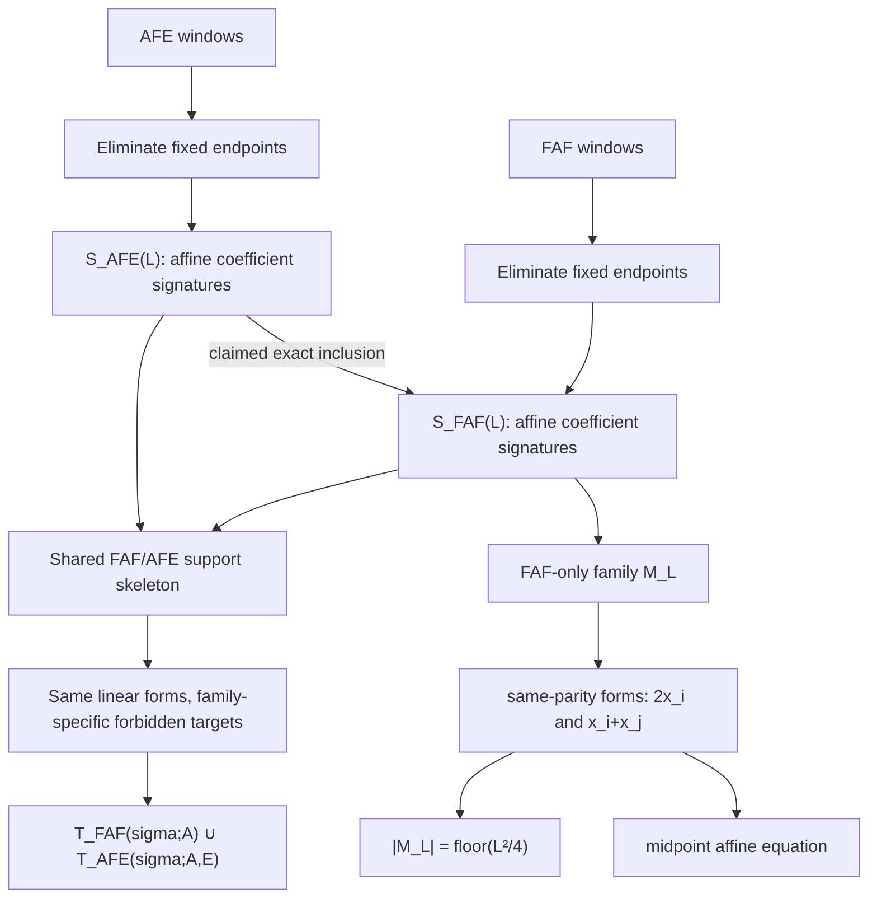

# Focused Literature Audit and Novelty Validation for Paper 4

## Executive summary

The literature audit materially sharpens, but does not eliminate, the novelty case for Paper 4. The broad machinery surrounding the project is **not new**: prefix-Parikh constraints, the discrete second-difference pattern \(+1,-2,+1\), arithmetic-progression tests on prefix Parikh data, template/ancestor reductions, morphic boundary corrections, two-stage morphic projections, structural sieves, and finite-state paths with semilinear/linear constraints all have clear precedents. Carpi's 1993 criterion is especially important: in the modern exact restatement of Carpi's Proposition 1, condition (C3) explicitly contains
\[
\psi(x_{j+1})-2\psi(x_j)+\psi(x_{j-1}),
\]
so Paper 4 should **not** claim the second-difference or prefix-Parikh viewpoint itself as novel. Currie–Rampersad likewise already encode Abelian repetitions by templates whose parent relation is a frequency-matrix term plus prefix/suffix Parikh corrections. citeturn19view3turn20view0turn20view1

The strongest novelty candidate remains much narrower and, in my assessment, more interesting: for Paper 4's specific staged FAF/AFE coefficient-signature families,
\[
S_{\mathrm{AFE}}(L)\subseteq S_{\mathrm{FAF}}(L),
\]
together with the exact classification
\[
S_{\mathrm{FAF}}(L)\setminus S_{\mathrm{AFE}}(L)=M_L,
\qquad
|M_L|=\left\lfloor \frac{L^2}{4}\right\rfloor,
\]
where \(M_L\) consists exactly of the same-parity midpoint forms \(2x_i\) and \(x_i+x_j\), and with the corresponding staged affine equation
\[
x_i+x_j
=
2p_A\!\left(\frac{i+j}{2}\right)+m(F)-m(A).
\]
I found **no exact analogue** of this inclusion/difference theorem, the exact same-parity classification, or the \(\lfloor L^2/4\rfloor\) count in the audited Carpi/Currie–Rampersad/Rao–Rosenfeld/Eyidoğan–Göral–Tanısalı corpus or in the surveyed Parikh-automata literature. That supports the status **POSSIBLY NEW**, not yet `NOVELTY_ESTABLISHED`. The distinction matters because an affine midpoint relation in isolation is close algebraically to Carpi's known second-difference relation; the plausible novelty is the **complete support-difference classification generated by the staged FAF-versus-AFE geometry**, not the mere appearance of a midpoint equation. citeturn19view3turn20view1turn21view1turn21view4turn22search0

The two principal unresolved novelty risks are **Carpi 1999** and **Keränen 2002/2003**. Carpi 1999 studies Abelian-square-free substitutions and gives decision algorithms for substitutions whose letter images form commutatively equivalent sets; Keränen's DT0L work explicitly combines \(g_{85}\) and \(g_{98}\), uses Carpi's algorithm on prefixes, and employs a modified test to suppress patterns that would create an Abelian square at the next iteration. That is unusually close in *research architecture* to Paper 4's staged approach. However, I could not obtain a reliably parsed full primary text of either Carpi 1999 or the 2002/2003 Keränen manuscript through the available access paths, so their internal propositions remain the most important specialist-read items before making a strong novelty statement. citeturn23search0turn18search2turn23search27

My present recommendation is therefore: **treat the FAF–AFE support theorem and exact midpoint-excess family as the candidate theorem contribution; treat prefix-Parikh/second-difference/template/CSP machinery as prior-art infrastructure; and postpone any phrase such as “new characterization” until Carpi 1999 and Keränen 2003 have been read line-by-line from authoritative full texts.**

## Claim map and relation to prior art

Throughout this report, \(S_{\mathrm{FAF}}(L)\) and \(S_{\mathrm{AFE}}(L)\) mean the **coefficient/signature support families used in Paper 4**, after the stated elimination of fixed \(F\)-prefix endpoints. They are not languages of words and not solution sets. That distinction should be made explicit in the paper because “support inclusion” could otherwise be misread as a semantic implication between the FAF and AFE predicates.

This diagram also shows where the strongest distinction from earlier template work appears to lie. Currie–Rampersad already separate morphic bulk from boundary corrections, and Rao–Rosenfeld already pull templates through a second morphism while controlling a projection kernel. What I did **not** find there is a theorem comparing two staged window families at the level of their **entire coefficient-support sets**, proving one support set contained in the other, and classifying the complement by a closed same-parity midpoint family. citeturn20view1turn21view1

There is, however, a conceptual caution. Eyidoğan–Göral–Tanısalı make arithmetic progressions among prefix data central to both their new sufficient conditions and their sieve, while their exact restatement of Carpi already uses vanishing/controlled second differences. Thus terminology such as “midpoint geometry” is safe as a descriptive name for Paper 4's derived family, but a novelty claim of the form **“we introduce midpoint/affine geometry into Abelian-power morphisms” would be too broad**. citeturn19view3turn20view3turn20view4

## Source-by-source comparison

| Source | Exact claim or mechanism relevant here | Overlap with Paper 4 | Assessment |
|---|---|---|---|
| **Carpi, 1993, _On Abelian Power-Free Morphisms_**, Proposition 1 | Carpi gives effective sufficient conditions for an \(h\) to preserve Abelian \(n\)-power-freeness. In the exact 2026 restatement of Prop. 1, condition (C3) tests proper prefixes \(x_j\) through \(\psi(x_{j+1})-2\psi(x_j)+\psi(x_{j-1})\in G_h\), and requires this second difference to equal an endpoint/image-vector second difference with \(\delta_j\in\{0,1\}\). For alphabets of size at least six, the conditions form a characterization; necessity below six remains Carpi's conjecture. citeturn17search3turn19view3 | Direct overlap with **prefix Parikh vectors** and **\(+1,-2,+1\) second differences**. | **MATCHES prior art** for these ingredients. This substantially narrows Paper 4 novelty. |
| **Carpi, 1999, _On Abelian Squares and Substitutions_** | The paper studies substitutions preserving Abelian-square-free words and substitutions with bounded Abelian squares, and establishes algorithms deciding these properties when each letter maps to a set of commutatively equivalent words. citeturn23search0turn17search7 | Potentially very close to Paper 4's partial/staged substitution logic and Parikh-equivalent image choices. | **HIGH-RISK / PARTIAL AUDIT.** Full internal proposition audit still required; primary PDF was indexed but not reliably readable in this session. |
| **Keränen, 2002/2003, _New Abelian Square-Free DT0L-Languages over 4 Letters_** | Keränen's description states that \(g_{98}\) is not itself globally Abelian-square-free, but can be combined with \(g_{85}\) in unlimited DT0L constructions. Crucially, the work says Carpi's algorithm is applied to prefixes of \(g_{85}(\Sigma)\) and \(g_{98}(\Sigma)\), together with a modified version that avoids patterns which would produce an Abelian square at the next iteration. citeturn18search2 | **Very close architecturally** to staged synthesis: one map need not be universally safe, and compatibility with a following stage is checked through prefix-sensitive conditions. | **PARTIAL / HIGHEST NOVELTY RISK.** No exact \(S_{\rm AFE}\subseteq S_{\rm FAF}\), \(M_L\), or \(\lfloor L^2/4\rfloor\) statement was located in accessible material, but the full manuscript must be checked. |
| **Keränen, 2009, _A Powerful Abelian Square-Free Substitution over 4 Letters_** | Restates Carpi's characterization in the setting of commutatively functional substitutions and constructs many Abelian-square-free endomorphisms plus a substitution with multiple commutatively equivalent images per letter. citeturn17search2turn18search3 | Reinforces that **substitution choices plus Carpi-style finite checks** are prior art, not unique to Paper 4. | **PARTIAL overlap; not an exact match** to the FAF–AFE support theorem. Worth a full specialist read as a surrogate/continuation of the 2003 work. |
| **Currie & Rampersad, 2012, _Fixed Points Avoiding Abelian \(k\)-Powers_** | A \(k\)-template records boundary letters and Parikh differences \(d_i\), with realization requiring \(\psi(X_{i+1})-\psi(X_i)=d_i\). Their parent relation satisfies the exact boundary/bulk equation \(\psi(a''_{i+1}a'_{i+2})-\psi(a''_ia'_{i+1})+D_iM=d_i\); the Parent Lemma pulls a realized parent forward through the morphism. Parents can be effectively enumerated under their matrix assumptions. citeturn20view0turn20view1turn20view2 | Direct prior art for **Parikh-template encoding, morphic bulk + prefix/suffix boundary correction, parent/ancestor reduction, finite exact search**. | **MATCHES machinery, not theorem.** I found no comparison of FAF-like and AFE-like signature supports or midpoint complement. |
| **Rao & Rosenfeld, 2018, _Avoiding Two Consecutive Blocks of Same Size and Same Sum over \(\mathbb Z^2\)_** | Generalizes the template approach to a broader class of morphisms. For a projected word \(g(h^\infty(a))\), parents under \(g\) may be infinite because of \(\ker M_g\), but a finite superset is computable when the expanding-space/kernel intersection is trivial. Their explicit \(g_3(h_6^\omega(a))\) construction gives a ternary word avoiding Abelian squares of period \(>5\), addressing a weak form of Mäkelä's problem. citeturn21view0turn21view1turn21view2turn21view3 | Strong prior art for **two-stage morphic construction, projection geometry, finite template certification, and the immediate Mäkelä context**. | **PARTIAL overlap.** Staged morphisms are clearly known; exact FAF–AFE support inheritance/midpoint excess was not found. |
| **Eyidoğan, Göral & Tanısalı, 2026, _Box Progressions, Abelian Power-Free Morphisms and A Sieve Technique for the Template Method_** | Gives new sufficient conditions for morphism power-freeness and a sieve for the Currie–Rampersad template method. It explicitly organizes prefix-Parikh information via arithmetic progressions/equivalence classes and can reduce huge parent/ancestor candidate sets to small selected sets. It also supplies the clean modern statement of Carpi's C1–C3 conditions. citeturn19view3turn20view3turn20view4 | Direct prior art for **prefix-Parikh arithmetic geometry** and **structural pruning/sieving before ancestor search**. | **MATCHES broad sieve concept; no exact match** found for the FAF–AFE difference theorem. |
| **Fici & Puzynina, 2023, _Abelian Combinatorics on Words: a Survey_** | Surveys fixed-point versus morphism power-freeness separately; attributes fixed-point decidability under suitable assumptions to Currie–Rampersad and later generalizations, and morphism-preservation conditions to Carpi. citeturn21view4 | Useful state-of-art cross-check and terminology map. | **CONTEXT, not novelty evidence by itself.** The survey did not expose an FAF–AFE analogue. |
| **Klaedtke & Rueß, 2002/2003, Parikh automata** | Introduces the Parikh-automata line connecting automata, commutative images, semilinear sets and Presburger/linear-cardinality constraints. The Freiburg technical-report record explicitly lists those topics. citeturn22search2turn22search11 | Broad prior art for **finite-state control plus linear/semilinear counting constraints**. | **MATCHES abstraction only.** It does not supply the word-specific staged support theorem. |
| **Cadilhac, Finkel & McKenzie, 2011/2012, Parikh/constrained automata** | A Parikh automaton is equivalently a finite automaton with a semilinear constraint on transition counts; their “constrained automaton” formulation makes this explicit, and affine variants permit affine updates. citeturn22search0turn22academia24 | Relevant to the broad interpretation of Paper 4 as a path problem with affine/semilinear constraints. | **KNOWN framework**, not close enough to threaten the exact FAF–AFE theorem. |
| **Stjerna & Rümmer, 2024, _A Constraint Solving Approach to Parikh Images of Regular Languages_** | Recasts reasoning about Parikh images of regular languages as a constraint-solving problem and extends the calculus to images under homomorphisms. citeturn22search1turn22search4 | Prior art for saying “compile automaton/path Parikh information into arithmetic constraints.” | **MATCHES computational framing only.** Do not present generic Parikh-CSP compilation as a new conceptual abstraction. |

### Exact-analogue check

Within this corpus, the result is:

| Paper 4 candidate claim | Closest prior art found | Audit verdict |
|---|---|---|
| \(S_{\mathrm{AFE}}(L)\subseteq S_{\mathrm{FAF}}(L)\) | Template-parent inheritance in Currie–Rampersad; staged projection/parent control in Rao–Rosenfeld. citeturn20view1turn21view1 | **No exact analogue located → POSSIBLY NEW.** |
| \(S_{\mathrm{FAF}}(L)\setminus S_{\mathrm{AFE}}(L)=M_L\) | No theorem classifying the support difference between two staged window families located. | **POSSIBLY NEW.** |
| \(M_L=\{2x_i,\ x_i+x_j:i<j,\ i\equiv j\pmod2\}\) | Prefix-Parikh arithmetic progressions and second differences are known, but not this exact same-parity complement family. Carpi's C3 and the 2026 sieve are the nearest algebraic relatives. citeturn19view3turn20view3 | **POSSIBLY NEW as an exact classification.** |
| \(|M_L|=\lfloor L^2/4\rfloor\) | No corresponding enumerative formula located in the audited Abelian-morphism/template literature. | **POSSIBLY NEW**, conditional on the family itself being new. |
| \(x_i+x_j-2p_A((i+j)/2)+m(A)-m(F)=0\) | Carpi already has an explicit \(+1,-2,+1\) prefix-Parikh relation; arithmetic-progressive prefix data are also central in Dekking/2026 work. citeturn19view3 | **Exact staged formula not found, but the algebraic motif is KNOWN.** Best stated as a corollary of the new \(M_L\) classification, not as a standalone novelty claim. |
| “FAF and AFE share a support skeleton but differ by forbidden affine target sets” | Template methods separate linear forms/boundary data; Parikh automata use semilinear target constraints. citeturn20view1turn22search0 | **Possibly new as this exact staged decomposition**, but the generic “linear forms + target constraints” idea is not new. |

The negative search result should be interpreted conservatively. A literature search can establish that an analogue was **not located in the sources and terminology audited**; it cannot mathematically prove that no one has ever stated an equivalent lemma. That is especially true here because Paper 4's `FAF` and `AFE` labels are project-specific, while an earlier equivalent statement could be phrased in terms of prefix cuts, substitution tables, ancestors, partial images, boundary vectors, or arithmetic progressions.

## Novelty risks and the passages that matter most

The novelty risk is now concentrated rather than diffuse.

**Carpi 1993 is no longer a risk; it is a known-prior-art boundary.** Proposition 1/C3 should be cited affirmatively. Paper 4 can say that its prefix equations live in the classical Carpi prefix-Parikh/second-difference tradition. The exact condition in the 2026 restatement is sufficiently close that omitting Carpi would likely invite a reviewer objection. citeturn19view3

**Carpi 1999 remains a serious unresolved risk.** The article is specifically about Abelian-square-preserving substitutions and bounded Abelian squares, with decidability for substitutions assigning commutatively equivalent image sets. citeturn23search0 The full text should be searched manually for the terms and concepts:

`prefix`, `suffix`, `commutatively functional`, `commutatively equivalent`, `boundary`, `factorization`, `substitution`, `compatible`, `condition`, `Proposition`, `Lemma`, and any reduction from a square in a substituted word to partial images of adjacent letters.

The question is not merely whether Carpi writes \(S_{\rm AFE}\subseteq S_{\rm FAF}\). The real risk is that a proposition there **implies the Paper 4 support classification after specializing to a uniform staged morphism**.

**Keränen 2002/2003 is probably the single most important specialist read.** Available text explicitly says the construction combines \(g_{98}\) and \(g_{85}\), applies Carpi's algorithm to their prefixes, and uses a modified algorithm to suppress patterns that would cause a square at the next iteration. citeturn18search2 That is close enough to Paper 4's staged philosophy that the manuscript should be treated as mandatory reading before submission. In particular, inspect the passage headed “Carpi's characterisation of a-2-free morphisms,” the modified prefix algorithm, and the definition/list of “undesirable patterns.” Determine whether those patterns are classified purely by support, and whether any same-parity or midpoint indexing occurs.

**Currie–Rampersad's Parent Lemma is the most important conceptual comparison.** Their parent equation already has exactly the form “boundary Parikh correction plus a linear image term equals a target template difference.” citeturn20view1turn20view2 A reviewer might therefore regard Paper 4's target-bucket description as a specialization/implementation of template machinery unless the paper clearly identifies what the new theorem says that template ancestry does not. The defensible answer is likely: **Paper 4 proves a closed-form relation between the complete support families of two distinct staged constraint systems**, including an exact complement and cardinality, rather than merely providing an algorithm to enumerate parents.

**Rao–Rosenfeld is the main staged-morphism risk.** They explicitly consider \(g(h^\infty)\), explain why projection through \(g\) can create infinitely many formal parents, and recover finiteness through the geometry of \(\ker M_g\) and the relevant invariant/eigenspace. citeturn21view1turn21view2 Paper 4 should therefore avoid phrases suggesting that applying a second morphism and reasoning about partial information at an intermediate stage is itself new.

**Eyidoğan–Göral–Tanısalı is the main terminology collision risk.** Their 2026 paper already describes prefix-Parikh sets through arithmetic progressions and builds a sieve that selects the few parent templates that can actually matter. citeturn19view3turn20view3turn20view4 Consequently, “midpoint,” “arithmetic progression,” “prefix geometry,” and “sieve” should be used with careful attribution. What remains distinctive is the exact **same-parity excess family between FAF and AFE support sets**.

The Parikh-automata literature is a lower novelty risk but an important positioning guardrail. Parikh automata can be viewed as finite automata whose transition counts are constrained by a semilinear set, and modern work explicitly treats Parikh-image computation as arithmetic constraint solving. citeturn22search0turn22search1 Thus claims such as “we introduce a finite-state path plus linear arithmetic representation” would be too general. Paper 4 can instead claim a **problem-specific exact compilation and structural theorem**.

## Recommended positioning and verification program

### Improved Paper 4 positioning

A defensible concise positioning paragraph is:

> **Our approach builds on the classical use of prefix Parikh vectors in Abelian-power-free morphisms, beginning with Carpi's effective criteria, and on the template/ancestor framework of Currie and Rampersad and its later extensions to projected morphic words. The new contribution is not the second-difference or boundary-Parikh machinery itself. For the staged FAF and AFE constraint systems arising in our construction, we determine their affine coefficient-support families exactly: the AFE support is contained in the FAF support, and the complement is precisely a same-parity midpoint family of cardinality \(\lfloor L^2/4\rfloor\). This yields a common-support formulation in which the two stages differ through their forbidden affine targets, providing both a structural description of staged compatibility and an exact finite constraint representation.**

That paragraph is supportable by the currently audited prior art while leaving room to soften “new contribution” to “our principal structural result” until Carpi 1999/Keränen 2003 are fully cleared. Carpi supplies the prefix second-difference precedent; Currie–Rampersad supply the template/boundary precedent; Rao–Rosenfeld supply the projected-stage precedent. citeturn19view3turn20view1turn21view1

I would also consider renaming the main result in the manuscript from an internal label such as “FAF–AFE theorem” to something externally intelligible, for example:

> **Support-Inheritance and Midpoint-Excess Theorem for Staged Abelian Constraints.**

The statement should define the signature support sets before using the FAF/AFE acronyms and should emphasize that the theorem is **an exact set identity**, not an empirical observation from \(L=40\).

### Prioritized follow-up checklist

The order matters.

1. **Obtain and read Carpi 1999 in full.** Institutional/author-copy access is warranted. Extract every proposition governing commutatively functional substitutions, partial image factors, and prefix/suffix boundary conditions. Do not clear novelty until this is done. The accessible abstract establishes that the paper's scope is directly relevant but is insufficient for theorem-level exclusion. citeturn23search0

2. **Obtain the complete Keränen 2002/2003 manuscript/proceedings version.** Read the Carpi-characterization section and modified \(g_{85}/g_{98}\) algorithm line by line. Specifically ask whether “undesirable patterns” are classified by a fixed coefficient support, whether the next-stage test creates only target changes, and whether parity/midpoint relations occur. The accessible description makes this the highest hidden-lemma risk. citeturn18search2turn23search27

3. **Full-read Keränen 2009 as a cross-check.** Its Proposition 1 restates Carpi in the commutatively functional substitution setting and may make the earlier manuscript's machinery more legible. citeturn18search3turn23search1

4. **Do a theorem-to-template derivation audit.** Starting from Currie–Rampersad equation (3), specialize their parent relation to Paper 4's constant-length staged setup. Determine explicitly whether
   \[
   S_{\rm AFE}\subseteq S_{\rm FAF}
   \]
   follows immediately from the Parent Lemma or requires genuinely new combinatorial case analysis. This is important even if the theorem is nowhere stated: a result can be unpublished yet still be viewed by referees as an obvious specialization. citeturn20view1turn20view2

5. **Perform the corresponding Rao–Rosenfeld specialization.** Translate FAF/AFE into their projected-template language and show precisely which part of the midpoint-excess theorem is *not* captured by the \(\ker M_g\)/parent machinery. citeturn21view1turn21view2

6. **Rewrite the theorem proof before promotion.** The already-discovered exposition defect—classifying cases by \(K\le L\) versus \(K>L\)—should be replaced by the mathematically correct split “both \(F\) copies contribute” versus “at most one \(F\) copy contributes.” Preserve the original hashed package and issue a new version rather than silently replacing it.

7. **Separate three novelty claims in the manuscript.**  
   **Known infrastructure:** prefix Parikh, second differences, template/boundary corrections, morphic projection, finite CSP/semilinear search.  
   **Candidate new theorem:** exact support inclusion and midpoint complement.  
   **Candidate new computational interpretation:** shared supports plus stage-dependent forbidden targets.  
   This separation will make the contribution much harder to overstate accidentally.

8. **Run the Report-7 target-collision census.** For every persisted \((E,A)\) pair, compute at least: number of shared signatures with overlapping FAF/AFE targets, target-union cardinality, multiplicity of target coincidences, first extinction depth, and—where tractable—the size/type of an UNSAT core. Compare the 48 H-side intersection survivors against H-negative and R-negative controls. This does not establish novelty, but it tests whether the target geometry has explanatory content beyond being a solver representation.

9. **Instrument one-solve UNSAT extraction rather than repeated re-solving.** The current evidence says each constraint family can be satisfiable alone while the union is unsatisfiable. A trace-derived core could reveal a small structural obstruction and potentially produce a second theorem-level result distinct from the support theorem.

10. **Extend the midpoint ablation from probes to a census.** The initial ten-pair observation that removing the 400 \(L=40\) FAF-only midpoint signatures does not change satisfiability is intriguing, but it should remain empirical until tested across the full relevant population. If the midpoint family proves universally redundant under additional conditions, that would itself be mathematically interesting; if it is occasionally essential, characterize those cases.

11. **Before manuscript submission, run a terminology-directed specialist search** for variants of: “partial morphism,” “two-level substitution,” “DT0L Abelian square,” “prefix/suffix Parikh,” “commutatively functional substitution,” “parent template support,” “boundary vector,” “arithmetic progression of prefixes,” “second difference,” “three-term progression,” and “projected morphic word.” The present exact-string search is encouraging but cannot exclude an equivalent result written in older terminology.

## Prioritized bibliography and reading order

**Must read in full before a strong novelty claim**

**Arturo Carpi, “On Abelian Power-Free Morphisms,” _International Journal of Algebra and Computation_ 3(2), 151–167 (1993).** DOI: [10.1142/S0218196793000123](https://doi.org/10.1142/S0218196793000123). The publisher abstract confirms that Carpi gives an effective sufficient condition and an effective characterization in the larger-alphabet regime; the exact Proposition 1 conditions are cleanly restated as Theorem 2.6 of the 2026 Eyidoğan–Göral–Tanısalı paper. citeturn17search3turn19view3  
**Priority: highest, but conceptually already substantially audited through the exact modern restatement.**

**Arturo Carpi, “On Abelian Squares and Substitutions,” _Theoretical Computer Science_ 218(1), 61–81 (1999).** [ScienceDirect record](https://www.sciencedirect.com/science/article/pii/S0304397598002503). The accessible record confirms its focus on Abelian-square-preserving substitutions, bounded Abelian squares, and algorithms for substitutions with commutatively equivalent image sets. citeturn23search0turn23search23  
**Priority: highest unresolved item.** The full primary PDF was not reliably text-accessible in this audit.

**Veikko Keränen, “New Abelian Square-Free DT0L-Languages over 4 Letters” (2002/2003 manuscript/proceedings versions).** The work is bibliographically cited as a 2003 manuscript in later literature, while surviving descriptions discuss the 2002 \(g_{98}\) discovery and combined \(g_{85}/g_{98}\) DT0L construction. citeturn23search27turn18search2  
An accessible secondary/full-text discovery path is the [ResearchGate record containing the relevant excerpts](https://www.researchgate.net/publication/263886264_On_abelian_power-free_morphisms).  
**Priority: highest unresolved item.** An authoritative, complete primary copy should be obtained before submission.

**Veikko Keränen, “A Powerful Abelian Square-Free Substitution over 4 Letters,” _Theoretical Computer Science_ 410(38), 3893–3900 (2009).** DOI: [10.1016/j.tcs.2009.05.027](https://doi.org/10.1016/j.tcs.2009.05.027). A full-text copy is indexed through CORE, and the paper explicitly builds on Carpi's characterization and Keränen's earlier substitution work. citeturn17search4turn23search1  
**Priority: high**, especially for reconstructing the exact formalism behind the 2003 work.

**James D. Currie and Narad Rampersad, “Fixed Points Avoiding Abelian \(k\)-Powers,” _Journal of Combinatorial Theory, Series A_ 119(5), 942–948 (2012).** [arXiv:1106.1842](https://arxiv.org/abs/1106.1842); DOI: [10.1016/j.jcta.2012.01.006](https://doi.org/10.1016/j.jcta.2012.01.006). Their template definition, parent equation, Parent Lemma, and finite ancestor machinery are the closest formal comparison for Paper 4's boundary/target representation. citeturn20view0turn20view1turn23search17  
**Priority: must read/re-read in full.**

**Michaël Rao and Matthieu Rosenfeld, “Avoiding Two Consecutive Blocks of Same Size and Same Sum over \(\mathbb Z^2\),” _SIAM Journal on Discrete Mathematics_ 32(4), 2381–2397 (2018).** [arXiv:1511.05875](https://arxiv.org/abs/1511.05875); DOI: [10.1137/17M1149377](https://doi.org/10.1137/17M1149377). It is both direct Mäkelä-context prior art and the closest template treatment of a second morphism \(g(h^\infty)\). citeturn21view0turn21view1turn23search7  
**Priority: must read in full.**

**Sadık Eyidoğan, Haydar Göral, and Nihan Tanısalı, “Box Progressions, Abelian Power-Free Morphisms and A Sieve Technique for the Template Method” (2026).** [arXiv:2605.20504](https://arxiv.org/abs/2605.20504). It provides both the most convenient exact modern statement of Carpi's Proposition 1 and the newest sieve/template comparison, including arithmetic progressions in prefix data. citeturn17academia38turn19view3  
**Priority: must read in full because it is the newest and terminologically closest paper.**

**Gabriele Fici and Svetlana Puzynina, “Abelian Combinatorics on Words: a Survey” (2023).** [arXiv:2207.09937](https://arxiv.org/abs/2207.09937). The survey is useful for ensuring Paper 4 cites the correct branches of the morphism/fixed-point literature and does not conflate those two decision problems. citeturn21view4  
**Priority: read the Abelian-power/morphism sections fully; use as a citation map, not as primary novelty evidence.**

**Felix Klaedtke and Harald Rueß, “Parikh Automata and Monadic Second-Order Logics with Linear Cardinality Constraints,” Technical Report 177 (2002; conference line 2003).** [University of Freiburg technical-report index](https://www2.informatik.uni-freiburg.de/tr/2002/.index.html). The report connects automata, commutative images, semilinear sets, Presburger arithmetic, and linear-cardinality constraints. citeturn22search2  
**Priority: selective read**, mainly to bound broad CSP/automata novelty claims.

**Michaël Cadilhac, Alain Finkel, and Pierre McKenzie, “On the Expressiveness of Parikh Automata and Related Models” (2011).** [arXiv:1101.1547](https://arxiv.org/abs/1101.1547). The constrained-automaton equivalence—finite automaton plus a semilinear restriction on transition counts—is the cleanest comparison for generic “path + arithmetic target” formulations. citeturn22search0turn22academia24  
**Priority: selective read.**

**Alexander Stjerna and Philipp Rümmer, “A Constraint Solving Approach to Parikh Images of Regular Languages,” _Proceedings of the ACM on Programming Languages_ 8, OOPSLA1 (2024).** DOI: [10.1145/3649855](https://doi.org/10.1145/3649855). This is useful modern prior art for constraint-solving representations of Parikh images and homomorphic images of regular languages. citeturn22search1turn22search4  
**Priority: selective read**, principally for positioning solver methodology.

The resulting novelty assessment is therefore deliberately narrow:

\[
\boxed{
\begin{array}{l}
\text{prefix-Parikh / second difference / templates / sieves: KNOWN,}\\[2mm]
\text{exact FAF–AFE support inclusion: POSSIBLY NEW,}\\
\text{exact same-parity midpoint complement: POSSIBLY NEW,}\\
|M_L|=\lfloor L^2/4\rfloor:\ \text{POSSIBLY NEW,}\\
\text{shared-support + stage-specific target interpretation: POSSIBLY NEW as a specialization.}
\end{array}}
\]

The strongest next novelty-validation action is not another broad search. It is a **line-by-line specialist audit of Carpi 1999 and Keränen 2002/2003, followed by an explicit derivation comparison against Currie–Rampersad's Parent Lemma and Rao–Rosenfeld's projected-template construction**. If those four checks remain negative, the support-inheritance/midpoint-excess theorem will have a substantially stronger basis for being presented as an independent Paper 4 contribution.